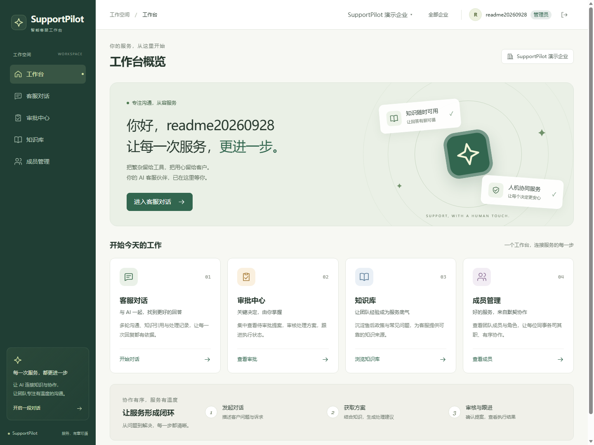
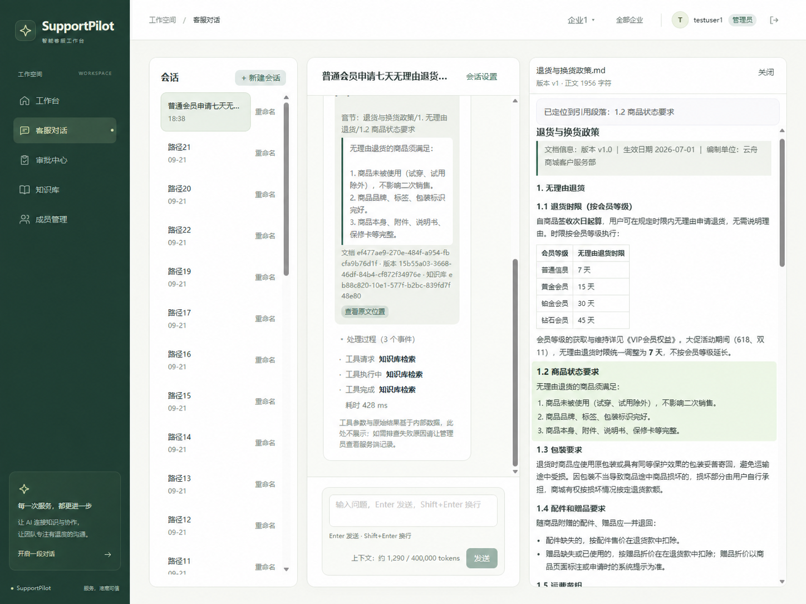
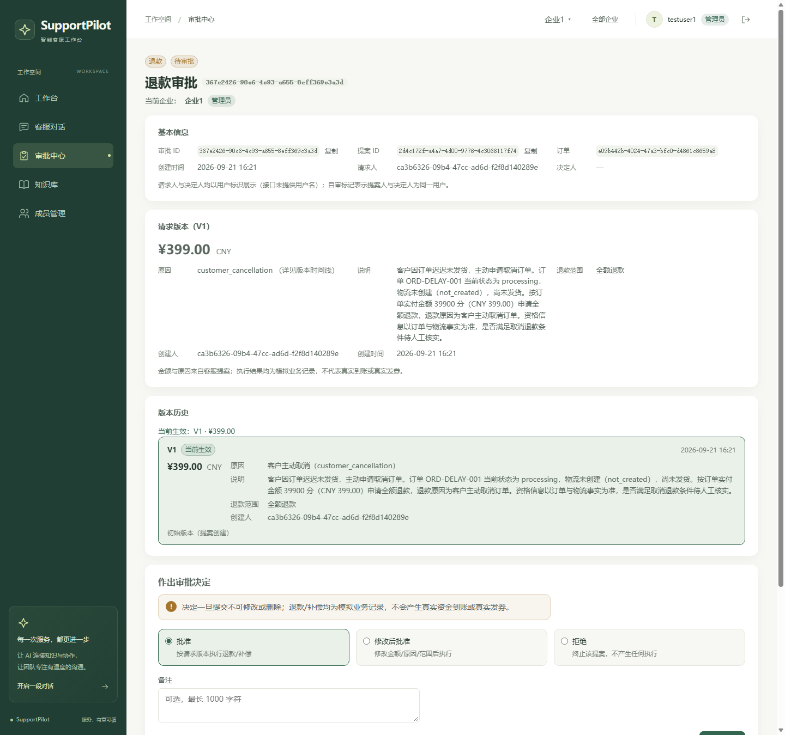
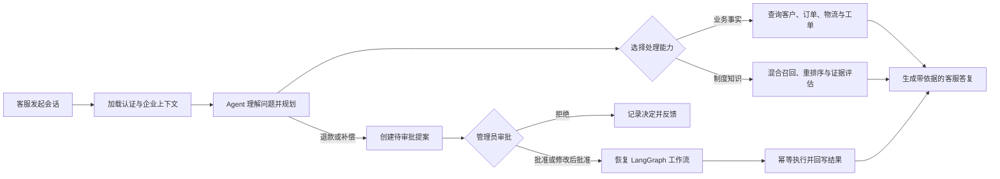
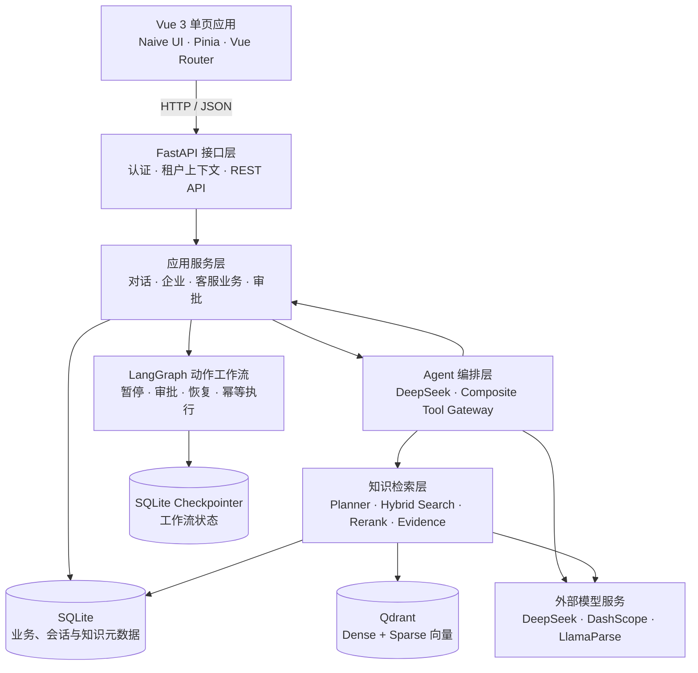

<div align="center">

# SupportPilot

**面向电商售后团队的多租户 AI 客服工作台**

让 Agent 在可信企业上下文中连接业务数据、知识库与人工审批，为客服提供可追溯、可管控的处理闭环。


</div>

## 主界面截图

### 工作台概览



### 带知识引用的客服对话

回答同时展示结构化知识引用、Agent 工具调用过程与检索摘要；点击“查看原文位置”后，可在右侧面板核对来源文档。



### 退款与补偿审批

审批中心统一承载退款与补偿提案。下图以退款提案为例，管理员可核对请求版本和变更历史，并选择批准、修改后批准或拒绝。



## 项目亮点

- **端到端客服 Agent**：串联客户、订单、物流、工单与知识检索工具，覆盖“理解问题—查询事实—生成答复—持续跟进”的客服路径。
- **可信多租户隔离**：认证、成员角色、会话、业务数据与知识库均绑定企业上下文；租户标识由服务端校验，不交给模型自由传入。
- **Agentic RAG**：支持查询规划、多查询混合召回、RRF 融合、统一重排序与证据充分性评估，并在回答中返回可定位的结构化引用。
- **人机协同审批**：退款与优惠券补偿先形成提案，再由管理员批准、修改后批准或拒绝；LangGraph 持久化暂停与恢复保障流程可追踪。
- **可靠执行机制**：通过版本化幂等键、独立 Checkpointer、失败重试与原 Run 恢复，降低重复审批、节点重放和执行中断带来的风险。
- **完整管理界面**：提供客服对话、审批中心、知识库、成员管理、企业切换及引用原文定位，兼顾管理员与客服成员的权限差异。

> 当前退款、补偿和优惠券结果均为模拟业务记录，不会触发真实支付、发券或外部 CRM 写入。

## 核心业务流程



## 系统架构



## 技术栈

| 层级 | 技术 | 用途 |
| --- | --- | --- |
| 前端 | Vue 3、TypeScript、Vite、Naive UI、Pinia、Vue Router、Axios | 工作台界面、状态管理与 API 通信 |
| API | Python 3.12、FastAPI、Pydantic、Uvicorn | HTTP 接口、参数校验与依赖注入 |
| Agent | OpenAI Python SDK、DeepSeek、LangGraph | 模型调用、工具编排与可恢复工作流 |
| 知识库 | DashScope Embedding、Qwen3-Rerank、Qdrant、LlamaParse | 文档解析、混合检索、重排序与引用定位 |
| 数据 | SQLite、SQLAlchemy、Alembic | 业务数据、会话、知识元数据与迁移 |
| 质量保障 | Pytest、Vitest、Vue Test Utils、ESLint | 后端、前端、集成与评测测试 |
| 部署 | Docker Compose、Nginx | 前后端与 Qdrant 的容器化部署 |

## 快速启动

### 方式一：Docker Compose（推荐）

准备好 Docker 与 Docker Compose 后，在项目根目录执行：

```powershell
Copy-Item .env.production.example .env.production
```

编辑 `.env.production`，至少配置：

- `DEEPSEEK_API_KEY`：对话模型密钥；
- `DASHSCOPE_API_KEY`：Embedding 与重排序服务密钥；
- `AUTH_SECRET_KEY`：不少于 32 个字符的随机字符串；
- `LLAMA_CLOUD_API_KEY`：可选，仅上传 PDF/DOCX 时需要。

启动完整服务：

```powershell
docker compose -f compose.production.yaml up -d --build
```

浏览器访问 [http://localhost](http://localhost)，注册账号并创建企业后即可进入工作台。首次体验可在企业选择页点击“生成测试数据”。

停止服务：

```powershell
docker compose -f compose.production.yaml down
```

### 方式二：本地开发

环境要求：Python 3.10+（推荐 3.12）、Node.js 20+、npm 10+、Docker 与 Docker Compose。

```powershell
# 启动向量数据库
docker compose up -d qdrant

# 安装并启动后端
python -m venv .venv
.\.venv\Scripts\Activate.ps1
pip install -r requirement.txt
Copy-Item .env.example .env
# 完成 .env 中的必填配置后启动
uvicorn main:app --reload --host 127.0.0.1 --port 8000
```

另开一个终端启动前端：

```powershell
Set-Location frontend
npm ci
npm run dev
```

访问 [http://127.0.0.1:5173](http://127.0.0.1:5173)。Vite 会把 `/api` 请求代理到 `http://127.0.0.1:8000`。

历史阶段说明与已完成能力详见 [阶段成果记录](docs/阶段成果记录.md)。
