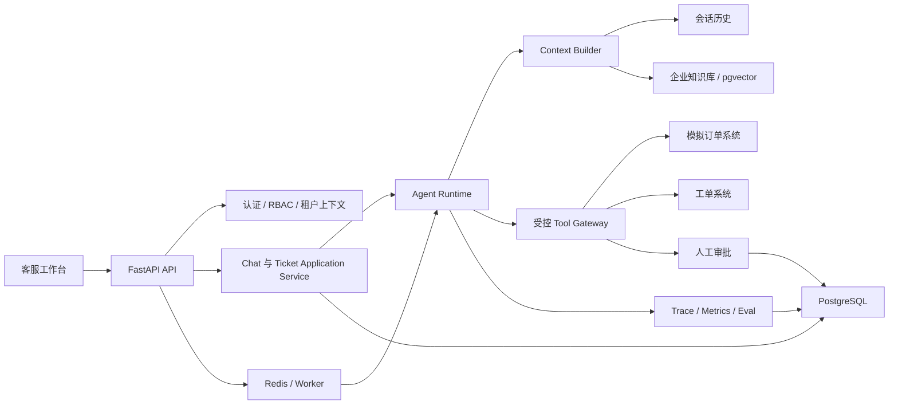

# SupportPilot 项目未来演进路线图

> 本文是项目级总路线图，用于确定产品方向、架构边界、实施顺序和验收标准。登录与租户、客服工具、RAG、审批工作流、Agent Eval、可观测性和部署属于相对独立的子系统；进入各阶段编码前，应分别建立独立的详细实施计划，并使用测试驱动开发逐项交付。

**目标：** 将当前简易 LLM 聊天后端演进为一个可登录、可隔离、可检索、可执行、可审批、可评测和可部署的多租户客服工单 Agent，并形成能够用于实习求职和技术面试的完整项目材料。

**总体架构：** 保留 Router、Application Service、Agent Runtime、Tool Gateway 和 Store 的模块边界。业务数据库是用户、租户、会话、工单、审批和审计数据的唯一事实来源；Agent Runtime 只负责模型编排与执行状态。前期继续使用自研 AgentRunner，出现人工审批、暂停恢复和长任务需求后，仅在编排层引入 LangGraph，不使用 LangChain 全量重构系统。

**建议技术栈：** Python 3.10+、FastAPI、Pydantic、PostgreSQL、SQLAlchemy 2.x、Alembic、Redis、后台任务 Worker、pgvector、pytest、Docker Compose、OpenTelemetry 或兼容 Trace 方案；前端可选 React/Vue，模型通过统一 Provider 接口接入 DeepSeek 或其他 OpenAI-compatible API。

---

## 1. 项目定位

### 1.1 项目名称

推荐名称：

> **SupportPilot：面向企业客服团队的多租户智能工单 Agent**

### 1.2 目标用户

- 使用客服工作台处理咨询和售后请求的企业客服人员。
- 负责配置企业知识库、工具权限和审批策略的企业管理员。
- 需要查看执行记录、评测结果和失败案例的开发或运营人员。

### 1.3 核心业务价值

SupportPilot 不只是回答问题，而是帮助客服完成一个受控的业务闭环：

1. 理解客户问题。
2. 检索当前企业的知识库和售后政策。
3. 查询订单、物流和历史工单。
4. 生成可追溯的处理建议与回复草稿。
5. 自动执行低风险操作，例如创建或分类工单。
6. 对退款、补偿、关闭工单等高风险操作发起人工审批。
7. 审批通过后恢复执行，并使用幂等键避免重复操作。
8. 保存完整的 Agent 运行轨迹、工具调用、审批和审计记录。

### 1.4 典型演示场景

用户提出：“订单已经三天没有发货，我希望退款。”

系统执行流程：

1. 客服人员登录并进入所属企业工作区。
2. Agent 根据订单号调用订单查询工具。
3. Agent 检索当前企业的发货与退款政策。
4. Agent 判断问题类型，生成处理建议和引用来源。
5. Agent 创建退款提案，但不直接执行退款。
6. 系统进入 `awaiting_approval` 状态，展示退款金额、原因和工具参数。
7. 客服人员选择批准、修改或拒绝。
8. 批准后 Agent 从暂停点恢复，执行退款模拟工具。
9. 工具使用 `idempotency_key`，重复提交也只产生一次退款结果。
10. 系统写入审计日志，并将最终处理结果返回客服人员。

---

## 2. 当前项目基础

当前代码已经具备以下有价值的工程基础：

- 自研模型与工具调用循环，能够理解 Agent Runtime 的底层行为。
- `AgentEvent` 事件模型，可继续扩展为 Trace 和运行状态事件。
- Router、ChatService、SessionStore、AgentRunner 和 Tool Registry 分层。
- SQLite 会话与完整消息持久化。
- 使用 `user_id + conversation_id` 进行会话所有权校验。
- 使用 Fake LLM 进行单元测试，不依赖真实模型接口。
- Agent 执行失败时不提交本轮局部聊天记录。

在开始后续功能前，先完成现有多用户持久化计划的 Task 5～8，并解决以下问题：

1. 新会话 Router 和 HTTP Schema 尚未全部替换旧接口。
2. `main.py` 仍使用全局 `messages` 和 JSON 历史文件。
3. `ConversationLockRegistry` 在持有注册表锁期间执行整个会话，导致不同会话也被全局串行化。
4. `update_system_prompt()` 对错误所有者更新零行时没有抛出未找到异常。
5. 锁异常释放测试存在不可达断言，需要补充真实回归测试。
6. AgentRunner 尚未限制最大步骤数、总超时和单工具超时。
7. 模型名称仍在 Runner 中硬编码，没有完整使用配置模块。
8. 生产 API 不应直接暴露完整 `reasoning_content`。

完成标准：

- 全局 `messages` 从生产入口移除。
- 同一会话请求串行，不同会话请求可以并行。
- 所有存储方法均校验用户和会话所有权。
- 模型异常不会写入局部历史。
- 新旧 Router 不同时存在。
- 全量自动化测试通过。

---

## 3. 目标系统架构



### 3.1 架构边界

#### API 层

- 只负责 HTTP 输入输出、认证依赖和错误映射。
- 不直接执行 SQL、拼装模型历史或调用具体工具。
- 不接受客户端提交的可信 `user_id` 或 `organization_id`。

#### Application Service 层

- 负责聊天、工单、审批等业务用例。
- 校验当前用户是否属于租户以及是否具备操作权限。
- 管理业务事务，但不实现 Agent 循环。

#### Agent Runtime 层

- 负责模型调用、工具选择、循环控制、暂停与恢复。
- 通过接口读取上下文和调用工具，不直接访问任意数据库表。
- 必须具备最大步骤、Token、时间和工具调用预算。

#### Tool Gateway 层

- 统一执行工具参数校验、权限校验、超时、重试和审计。
- 只向模型暴露完成当前业务所需的最小工具集合。
- 高风险写操作必须经过审批，不能由模型自行决定权限。

#### Store 层

- PostgreSQL 保存业务事实数据。
- Redis 只用于队列、限流、短期缓存或分布式协调，不作为业务事实来源。
- pgvector 保存知识库向量，任何检索必须附带 `organization_id` 过滤。

---

## 4. Agent 框架策略

### 4.1 决策

不使用 LangChain 对当前项目进行全量重构。继续保留现有模块结构，并将 Agent 执行抽象为框架无关接口：

```python
class AgentRuntime(Protocol):
    def run(
        self,
        *,
        messages: list[dict],
        context: AgentContext,
    ) -> AgentResult:
        ...
```

建议目录：

```text
app/agent/
├── base.py
├── custom_runtime.py
├── langgraph_runtime.py
├── events.py
├── state.py
└── policies.py
```

### 4.2 自研 Runtime 的适用范围

- 普通多轮聊天。
- 简单的模型—工具—模型循环。
- 同步、短时间完成的查询操作。
- 用于展示对工具调用协议、消息顺序和异常边界的理解。

### 4.3 引入 LangGraph 的触发条件

同时满足以下任一需求时，开始在单条业务工作流中引入 LangGraph：

- Agent 需要暂停并等待人工审批。
- 任务需要在进程重启后从断点恢复。
- 工作流存在多个明确节点、条件分支和重试路径。
- 任务可能运行较长时间，需要交给 Worker 异步执行。
- 需要查看或回放节点级状态变化。

### 4.4 迁移原则

1. 先为当前自研 Runtime 建立统一接口。
2. 保持 Router、Application Service、业务数据库和工具服务不变。
3. 只选择“退款审批”这一条工作流实现 LangGraph 版本。
4. 自研版与 LangGraph 版运行同一套 Agent Eval 数据集。
5. 比较任务成功率、恢复能力、延迟、Token 成本和维护复杂度。
6. 根据评测结果决定是否迁移其他工作流。

LangGraph checkpoint 只保存 Agent 的执行位置和临时状态，不替代 `conversations`、`tickets`、`approvals`、`audit_logs` 等业务数据表。

---

## 5. 分阶段实施路线

## 阶段 0：完成多用户会话基础

**预计时间：** 1～2 周

**交付内容：**

- 完成现有计划 Task 5～8。
- 删除生产入口中的全局消息列表。
- 完成会话创建、聊天和修改系统提示词的新接口。
- 修复跨会话并发锁。
- 补齐错误所有者、并发和异常释放测试。
- 增加 Runner 最大步骤数、模型调用超时和工具超时。
- 增加项目依赖文件、`.env.example` 和基础 README。

**验收标准：**

- 服务重启后会话历史可以恢复。
- 用户 B 不能访问用户 A 的会话。
- 同一会话的两个请求严格串行。
- 两个不同会话的 Runner 可以同时进入执行区。
- 模型调用失败时本轮消息不会进入数据库。
- 测试不访问真实模型 API。

## 阶段 1：登录、多租户和 RBAC

**预计时间：** 1～2 周

**交付内容：**

- 用户注册、登录、刷新和登出。
- 密码使用安全哈希保存。
- Access Token 与 Refresh Token 生命周期管理。
- 建立企业、用户与成员关系。
- 建立 `admin`、`agent`、`viewer` 三种最小角色。
- 从认证凭证中获取当前用户，不再从请求体接收 `user_id`。
- 所有会话、文档、工单和工具调用绑定 `organization_id`。
- 使用 Alembic 管理数据库迁移。

**建议核心表：**

```text
users
organizations
memberships
refresh_tokens
conversations
messages
```

**验收标准：**

- 未登录访问受保护接口返回 401。
- 无权限操作返回 403；需要隐藏资源存在性时统一返回 404。
- 修改请求体或 URL 不能越权访问其他租户数据。
- 被撤销的 Refresh Token 不能再次换取 Access Token。
- 数据库迁移可以从空数据库完整执行，也可以安全回滚最近一次迁移。

## 阶段 2：客服工单领域与受控工具

**预计时间：** 1～2 周

**交付内容：**

- 增加模拟订单、物流和工单数据。
- 实现查询型工具：
  - `get_order(order_no)`
  - `get_logistics(order_no)`
  - `get_ticket(ticket_id)`
- 实现低风险写工具：
  - `create_ticket(summary, category, priority)`
  - `add_ticket_note(ticket_id, content)`
- 工具使用 Pydantic Schema 校验输入和输出。
- Tool Gateway 注入当前租户与用户上下文，模型不能指定任意租户。
- 保存每次工具请求、参数、结果、错误、耗时和调用人。

**建议新增表：**

```text
customers
orders
shipments
tickets
ticket_comments
agent_runs
tool_calls
audit_logs
```

**验收标准：**

- Agent 能完成“查询订单并创建工单”的端到端流程。
- 模型构造其他租户的订单号时，工具仍不能读取该订单。
- 参数类型错误不会进入具体工具函数。
- 工具超时或异常会产生结构化失败事件，Agent 可以给出安全回复。
- 每次写操作均能从审计日志追溯到用户、租户、会话和 Agent Run。

## 阶段 3：知识库 RAG

**预计时间：** 1～2 周

**交付内容：**

- 企业管理员上传 Markdown、TXT 或 PDF 知识文档。
- 文档解析、分块、向量化和索引采用后台任务。
- 使用 PostgreSQL + pgvector 保存向量。
- 检索必须同时过滤 `organization_id` 和文档状态。
- Context Builder 控制检索片段数量和 Token 预算。
- 最终回答返回文档标题、片段和来源标识。
- 分别记录检索阶段与生成阶段的输入输出。

**建议新增表：**

```text
documents
document_versions
document_chunks
ingestion_jobs
retrieval_events
```

**验收标准：**

- 企业 A 无法检索企业 B 的任何文本片段。
- 删除或停用文档后，该文档不会继续进入检索结果。
- 回答中展示的引用可以定位到真实文档片段。
- 测试集能区分“没有检索到正确文档”和“检索正确但生成错误”。
- 对检索命中率、答案引用正确率和无依据回答率分别统计。

## 阶段 4：人工审批与可靠执行

**预计时间：** 1～2 周

**交付内容：**

- 增加退款提案和补偿提案。
- 建立 Agent Run 状态机：
  - `queued`
  - `running`
  - `awaiting_approval`
  - `succeeded`
  - `failed`
  - `cancelled`
- 高风险工具先生成待审批动作，不直接产生外部副作用。
- 审批支持批准、修改和拒绝。
- 使用幂等键保证重复提交只执行一次。
- 使用 LangGraph interrupt/checkpoint 实现退款流程的暂停和恢复。
- 明确区分可重试错误、需要用户修正的错误和不可恢复错误。

**建议新增表：**

```text
approvals
approval_decisions
tool_executions
idempotency_keys
agent_run_checkpoints
```

**验收标准：**

- 没有审批记录时退款工具永远不会执行。
- 审批人没有对应角色时不能批准。
- 相同幂等键提交两次只产生一次业务结果。
- 服务在等待审批期间重启，之后仍可从暂停点恢复。
- 拒绝后 Agent 能向客服解释未执行原因并结束运行。

## 阶段 5：Agent Eval 与反馈闭环

**预计时间：** 1～2 周

**交付内容：**

- 建立 40～60 条初始黄金测试样例。
- 样例覆盖正常路径、边界输入、工具错误、权限攻击和 Prompt Injection。
- 评测四个维度：
  - 最终答案是否解决问题。
  - 是否选择正确工具。
  - 工具参数是否正确。
  - 执行轨迹是否安全且高效。
- 优先使用确定性代码评测；主观质量再使用人工评审或 LLM-as-judge。
- 同一测试样例执行多次，统计非确定性波动。
- 保存模型、Prompt、工具 Schema 和代码版本元数据。
- 将线上失败 Trace 转化为新的回归测试样例。
- 在 CI 中设置最低质量门槛。

**建议指标：**

```text
task_success_rate
tool_selection_accuracy
tool_argument_accuracy
unsafe_action_rate
cross_tenant_leak_rate
grounded_answer_rate
average_tool_calls
average_tokens
p95_latency
estimated_cost
```

**验收标准：**

- 每次修改 Prompt、模型或工具 Schema 都可以运行离线评测。
- 评测结果可以比较两个版本，而不是只显示单次分数。
- 跨租户数据泄露和未审批高风险动作的允许失败率为 0。
- CI 能阻止明显低于当前基线的版本合并。
- 至少记录一个真实失败案例及其进入回归集的完整过程。

## 阶段 6：可观测性、流式交互和后台任务

**预计时间：** 1～2 周

**交付内容：**

- 为每个 HTTP 请求和 Agent Run 生成 `trace_id`。
- 记录模型、检索、工具、审批和数据库关键步骤的 Span。
- 记录耗时、Token、成本、重试次数和错误类型。
- 使用结构化 JSON 日志，不使用生产环境 `print()`。
- 使用 SSE 向前端发送文本增量和工具状态事件。
- 长任务通过 Redis 队列和 Worker 执行。
- 提供运行详情页，可查看 Agent 轨迹和失败节点。
- 对敏感字段进行日志脱敏。

**验收标准：**

- 通过一个 `trace_id` 可以还原完整调用链。
- 前端可以区分模型输出、工具开始、工具完成、等待审批和失败事件。
- 客户端断开不会导致已提交的后台任务状态丢失。
- 日志不包含密码、Token、API Key 和完整敏感客户信息。
- 可以按模型、工具和错误类型聚合延迟与失败率。

## 阶段 7：安全、部署和性能验证

**预计时间：** 1～2 周

**交付内容：**

- Dockerfile 和 Docker Compose。
- Compose 包含 API、PostgreSQL、Redis 和 Worker。
- 增加启动、存活和就绪健康检查。
- 增加限流、请求体大小限制和超时。
- 对工具实施最小权限、允许列表和服务端二次鉴权。
- 增加直接 Prompt Injection、间接 Prompt Injection 和持久化记忆污染测试。
- 增加并发与压测脚本。
- 建立 CI：静态检查、单元测试、集成测试、Eval 和镜像构建。
- 部署一个可公开访问的演示环境，但使用完全模拟的订单与退款数据。

**验收标准：**

- 新环境可以通过一条 Compose 命令启动。
- 依赖服务未就绪时 API 不会错误报告健康。
- 50 个并发会话下不会发生历史串话和重复工具执行。
- 非 LLM API 的 P95 延迟目标在测试环境中明确记录。
- 安全测试覆盖越权、Prompt Injection、工具滥用和敏感信息泄露。
- 发布版本具有可复现的镜像标签、迁移步骤和回滚说明。

---

## 6. 数据模型总览

推荐最终核心实体：

```text
organizations
users
memberships
refresh_tokens

conversations
messages

customers
orders
shipments
tickets
ticket_comments

documents
document_versions
document_chunks
ingestion_jobs

agent_runs
tool_calls
tool_executions
approvals
approval_decisions
idempotency_keys
audit_logs
retrieval_events
```

关键约束：

- 除全局配置外，业务表都必须能够追溯到 `organization_id`。
- `user_id` 和 `organization_id` 来自认证上下文，不接受模型或普通请求字段覆盖。
- `agent_runs` 区分业务会话与单次执行；一个会话可以对应多个 Run。
- `tool_calls` 记录模型提出的调用，`tool_executions` 记录真正发生的副作用。
- `approvals` 绑定待执行动作，而不是只绑定自然语言描述。
- 审计日志只追加，不允许普通用户修改历史记录。

---

## 7. Agent 可靠性与安全规则

### 7.1 执行预算

每次 Agent Run 必须配置：

- 最大模型调用次数。
- 最大工具调用次数。
- 最大总执行时间。
- 单次模型超时。
- 单次工具超时。
- 最大上下文 Token。
- 最大预估成本。

超过预算后进入结构化失败状态，不允许无限循环。

### 7.2 工具分类

```text
READ_ONLY
LOW_RISK_WRITE
HIGH_RISK_WRITE
```

- 只读工具可以在权限校验后自动执行。
- 低风险写工具必须支持幂等和审计。
- 高风险写工具必须创建审批记录并暂停执行。
- 工具权限由服务端策略决定，不能让 Prompt 或模型自行提升权限。

### 7.3 Prompt 与记忆安全

- 用户输入、知识库内容和工具结果均视为不可信数据。
- 知识库中的文本不能覆盖系统指令或权限策略。
- 长期记忆只能写入经过验证的结构化事实。
- 不将完整内部推理过程作为普通 API 响应返回。
- 日志与 Trace 中的客户信息、Token 和凭证必须脱敏。
- 对“忽略之前规则”“读取其他企业数据”“直接退款”等攻击样例建立固定回归测试。

---

## 8. 测试体系

### 8.1 单元测试

- AgentRunner 消息顺序、工具参数和异常路径。
- RBAC 与租户数据过滤。
- Tool Gateway 权限、超时和幂等。
- Context Builder 的 Token 预算与片段选择。
- 状态机的合法和非法转换。

### 8.2 集成测试

- API + PostgreSQL。
- Agent Service + Fake Runtime。
- Tool Gateway + 模拟业务系统。
- RAG 入库、检索和租户隔离。
- Worker 任务和重试。
- LangGraph 暂停、重启和恢复。

### 8.3 端到端测试

- 登录后完成订单查询和工单创建。
- 发起退款、等待审批、批准并恢复执行。
- 服务重启后恢复会话和待审批 Run。
- 跨租户访问与恶意 Prompt 均不能泄露数据。

### 8.4 Agent Eval

- 最终答案评测。
- 单步工具选择评测。
- 工具参数评测。
- 完整轨迹评测。
- 多次 trial 稳定性评测。
- 延迟、Token 和成本评测。

---

## 9. 暂不优先实现的能力

以下能力在核心闭环、评测和可靠性完成前不作为主线：

- 多 Agent 协作。
- 开放式自主规划十几步任务。
- 长期人格记忆。
- 语音和多模态。
- Kubernetes。
- 微服务拆分。
- 自研向量数据库。
- 为展示技术栈而接入多个 Agent 框架。
- 在没有真实使用需求时接入 MCP。

后期可以把 MCP 作为 Tool Gateway 的一种适配协议，但所有 MCP 工具仍必须经过租户权限、参数验证、审计和审批策略。

---

## 10. 项目交付物

为了让项目能够真正用于简历和面试，最终至少准备以下材料：

- 可公开访问的演示环境。
- 三分钟以内的核心流程演示视频。
- 完整 README 和一键启动命令。
- 系统架构图和数据库 ER 图。
- API 文档和典型请求示例。
- 关键技术决策记录，例如为什么使用模块化单体、为什么只在审批流程引入 LangGraph。
- Agent Eval 数据集和版本对比报告。
- 并发压测报告。
- Prompt Injection 与越权测试报告。
- 一篇故障复盘：问题如何发生、如何定位、如何修复、如何进入回归测试。

README 应回答：

1. 这个项目解决什么业务问题？
2. Agent 为什么比固定流程更适合其中的哪些环节？
3. 哪些环节刻意保持为确定性代码？
4. 如何保证租户隔离和工具权限？
5. 如何评测 Agent 是否真的变好？
6. 工具失败、服务重启和重复请求时系统如何处理？
7. 如何在本地复现完整业务流程？

---

## 11. 简历描述参考

只有实际实现并测量后，才能将对应内容写入简历。所有数字必须来自测试报告，不得虚构。

示例一：

> 独立设计并实现多租户客服工单 Agent，基于 FastAPI、PostgreSQL、Redis 和 pgvector，实现 JWT/RBAC、会话隔离、企业知识库检索、受控工具调用、人工审批及审计追踪。

示例二：

> 构建覆盖最终回答、工具选择、参数及执行轨迹的 Agent Eval 流水线，通过黄金数据集和 CI 回归检测模型、Prompt 与工具 Schema 变更，并将线上失败 Trace 持续沉淀为回归样例。

示例三：

> 为退款等高风险操作设计持久化状态机，引入人工审批、幂等键、超时、重试和断点恢复；仅在长任务编排层使用 LangGraph，保留业务层与工具层的框架无关设计。

---

## 12. 面试叙事主线

项目应形成以下完整技术故事：

1. 最初版本为什么会发生全局聊天历史串话。
2. 如何通过 `user_id + conversation_id`、所有权校验和会话级锁解决隔离问题。
3. 为什么错误的锁范围会导致不同会话也被串行化。
4. 为什么登录后不能继续相信请求体中的 `user_id`。
5. 为什么 Agent 不能直接获得任意写工具权限。
6. 为什么退款需要审批、幂等和审计。
7. 为什么 RAG 要分别评测检索和生成。
8. 为什么普通聊天保留自研 Runtime，而审批流程选择 LangGraph。
9. 如何通过 Trace 定位一次非确定性 Agent 失败。
10. 如何将失败案例转化为 Eval 和 CI 回归测试。

最终希望向面试官证明的不是“使用过多少框架”，而是：

> 能够把不确定的模型行为放进一个可测试、可评测、可观察、权限受控、失败可恢复的业务系统中。

---

## 13. 后续独立实施计划

进入编码前，按以下顺序分别创建详细计划，避免一个超大计划同时修改多个子系统：

1. `multi-user-session-completion`：完成当前 Task 5～8 和并发修复。
2. `authentication-and-multi-tenancy`：登录、租户、RBAC 和数据库迁移。
3. `customer-support-domain-tools`：订单、物流、工单和 Tool Gateway。
4. `tenant-scoped-rag`：文档入库、向量检索、引用和检索评测。
5. `approval-and-durable-execution`：高风险动作审批、幂等和 LangGraph 恢复。
6. `agent-evaluation-pipeline`：黄金数据集、评测器、版本对比和 CI 门槛。
7. `agent-observability-and-streaming`：Trace、指标、SSE 和运行详情。
8. `deployment-security-and-load-testing`：Compose、CI、安全测试和压测。

每份子计划必须包含：

- 精确文件路径与模块职责。
- 明确接口和数据模型。
- 先失败测试、再最小实现、再全量验证。
- 数据迁移与回滚方式。
- 安全边界与错误映射。
- 可量化验收条件。
- 每个独立任务的提交范围。

---

## 14. 参考资料

- LangGraph Overview：<https://docs.langchain.com/oss/python/langgraph/overview>
- LangGraph Persistence：<https://docs.langchain.com/oss/python/langgraph/persistence>
- LangChain Human-in-the-loop：<https://docs.langchain.com/oss/python/langchain/human-in-the-loop>
- LangGraph v1 Migration Guide：<https://docs.langchain.com/oss/python/migrate/langgraph-v1>
- OpenAI Practical Guide to Building Agents：<https://openai.com/business/guides-and-resources/a-practical-guide-to-building-ai-agents/>
- Anthropic Demystifying Evals for AI Agents：<https://www.anthropic.com/engineering/demystifying-evals-for-ai-agents>
- LangSmith Evaluation：<https://docs.langchain.com/langsmith/evaluation>
- OWASP Excessive Agency：<https://genai.owasp.org/llmrisk/llm062025-excessive-agency/>
- OWASP Prompt Injection Prevention Cheat Sheet：<https://cheatsheetseries.owasp.org/cheatsheets/LLM_Prompt_Injection_Prevention_Cheat_Sheet.html>

