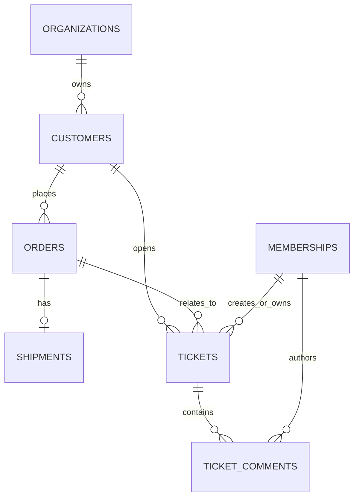

# Simulated Customer Support Domain Data Implementation Plan

> **For agentic workers:** REQUIRED SUB-SKILL: Use superpowers:subagent-driven-development (recommended) or superpowers:executing-plans to implement this plan task-by-task. Steps use checkbox (`- [ ]`) syntax for tracking.

**Goal:** 在现有多租户基础上建立一套可重复生成、严格按企业隔离的模拟客服业务数据，包括客户、订单、物流、工单和工单评论，为后续确定性业务服务和 Agent 工具提供稳定的数据源。

**Architecture:** 每个业务实体使用独立的领域模块、Store 协议和同步 SQLite 实现，沿用当前 `base.py + sqlite_store.py` 风格；每次读写都显式接收 `organization_id`，数据库通过复合唯一键和复合外键阻止跨租户关联。五类数据分五个连续 Alembic revision 交付，最后由一个管理员专用、可重复执行的 Demo Seeder 生成固定业务场景；本计划不增加 HTTP API，也不把这些 Store 直接暴露给 LLM。

**Tech Stack:** Python 3.10+、标准库 `dataclasses` / `enum` / `sqlite3` / `datetime` / `argparse`、SQLite、Alembic 1.x、SQLAlchemy 2.x（迁移 DDL）、pytest。

## Global Constraints

- 当前基线为 Alembic `0003_conversation_tenant_scope`，调研时全量测试为 `96 passed`。
- 本计划只实现 `customers`、`orders`、`shipments`、`tickets`、`ticket_comments`、对应 Store 和模拟数据 Seeder。
- 本计划不实现 HTTP API、Application Service、Agent 工具、Tool Gateway、RAG、退款、审批、真实第三方订单系统或前端页面。
- 每张业务表都必须直接包含 `organization_id`；任何按 ID、业务编号或关联对象的查询都必须同时过滤 `organization_id`。
- 客户号、订单号、物流单号、跟踪号和工单号只要求“企业内唯一”；企业 A 和企业 B 可以拥有相同业务编号。
- 跨表关系必须使用包含 `organization_id` 的复合外键，不能只依赖应用代码判断租户。
- 数据库内部主键使用 UUID 字符串；对客服展示和工具查询使用 `customer_no`、`order_no`、`shipment_no`、`ticket_no`。
- 金额统一保存为整数分 `total_amount_cents`，不得使用 `float`；币种使用三位大写代码，本计划种子数据固定为 `CNY`。
- 领域时间继续使用项目现有的字符串风格，所有 Seeder 生成的业务时间必须是 UTC ISO 8601 字符串。
- 第一版一个订单最多对应一个物流记录，不实现拆单、多包裹和部分发货。
- 第一版订单只保存 `item_summary`，不增加 `products`、`order_items`、优惠券、支付流水或库存表。
- 第一版工单必须关联客户，可以选择关联订单；不在本阶段关联会话或 Agent Run。
- 工单创建人、负责人和评论作者必须是当前企业的 membership；跨企业用户 ID 即使真实存在也不能建立关联。
- 模拟客户信息只能使用虚构姓名、保留域名 `example.test` 和明显无效的电话号码，不写入真实个人信息。
- Demo Seeder 只允许企业 `admin` 执行；重复执行不得产生重复客户、订单、物流、工单或评论。
- 各 Store 构造函数继续调用现有 `upgrade_database()`；DDL 只能写在 Alembic migration 中。
- 每个 Task 必须在提交前运行本 Task 局部测试和 `python -m pytest -q`，全量测试必须保持通过。

---

## 1. 业务场景

完成后，每个演示企业可以拥有以下三条确定性场景：

### 场景 A：延迟未发货

```text
客户：CUST-001
订单：ORD-DELAY-001
订单状态：processing
承诺发货时间：参考时间前 3 天
物流记录：不存在
工单：TKT-DELAY-001，logistics / high / open
```

后续 `get_order()` 和 `get_logistics()` 可以据此判断“订单存在，但尚未产生物流记录”。

### 场景 B：运输中

```text
客户：CUST-001
订单：ORD-TRANSIT-001
订单状态：shipped
物流：SHP-TRANSIT-001，in_transit
预计送达：参考时间后 1 天
```

### 场景 C：已签收但商品破损

```text
客户：CUST-002
订单：ORD-DELIVERED-001
订单状态：delivered
物流：SHP-DELIVERED-001，delivered
工单：TKT-DAMAGE-001，damaged_item / medium / pending_customer
评论：客服要求客户补充破损照片
```

## 2. 状态枚举

```text
OrderStatus
  pending_payment
  paid
  processing
  shipped
  delivered
  cancelled
  refunded

ShipmentStatus
  pending
  picked_up
  in_transit
  delivered
  exception
  returned

TicketCategory
  logistics
  refund
  damaged_item
  product_question
  other

TicketPriority
  low
  medium
  high
  urgent

TicketStatus
  open
  in_progress
  pending_customer
  resolved
  closed

TicketCommentVisibility
  internal
  public
```

## 3. 数据关系



关键复合约束：

```text
orders(organization_id, customer_id)
  → customers(organization_id, id)

shipments(organization_id, order_id)
  → orders(organization_id, id)

tickets(organization_id, order_id, customer_id)
  → orders(organization_id, id, customer_id)

tickets(organization_id, created_by_user_id)
  → memberships(organization_id, user_id)

ticket_comments(organization_id, ticket_id)
  → tickets(organization_id, id)
```

## 4. 最终文件结构

```text
migrations/versions/
  0004_customers.py
  0005_orders.py
  0006_shipments.py
  0007_tickets.py
  0008_ticket_comments.py
app/
  customers/
    __init__.py
    base.py
    sqlite_store.py
  orders/
    __init__.py
    base.py
    sqlite_store.py
  shipments/
    __init__.py
    base.py
    sqlite_store.py
  tickets/
    __init__.py
    base.py
    sqlite_store.py
  demo_data/
    __init__.py
    seeder.py
    cli.py
tests/
  customers/test_customer_store.py
  orders/test_order_store.py
  shipments/test_shipment_store.py
  tickets/test_ticket_store.py
  demo_data/test_seeder.py
  demo_data/test_cli.py
  db/test_migrations.py
docs/
  demo-business-data.md
```

---

### Task 1: 客户表、领域模型和租户隔离 Store

**独立验收产物：** 可以在企业内创建并查询客户；相同 `customer_no` 可以存在于不同企业；错误企业查询返回未找到；数据库拒绝不存在的企业和同企业重复客户号。

**Files:**
- Create: `migrations/versions/0004_customers.py`
- Create: `app/customers/__init__.py`
- Create: `app/customers/base.py`
- Create: `app/customers/sqlite_store.py`
- Create: `tests/customers/test_customer_store.py`
- Modify: `tests/db/test_migrations.py`

**Interfaces:**
- Consumes: `upgrade_database(database_path)`
- Produces: Alembic revision `0004_customers`
- Produces: `Customer`
- Produces: `CustomerStore.create_customer(...) -> Customer`
- Produces: `CustomerStore.get_by_id(...) -> Customer`
- Produces: `CustomerStore.get_by_no(...) -> Customer`
- Produces: `CustomerNotFoundError`、`CustomerAlreadyExistsError`、`InvalidCustomerReferenceError`

- [ ] **Step 1: 写客户迁移失败测试**

在 `tests/db/test_migrations.py` 增加：

```python
def test_customer_migration_upgrade_and_rollback(tmp_path):
    database_path = tmp_path / "customers.db"
    config = alembic_config(database_path)

    command.upgrade(config, "0004_customers")

    assert "customers" in table_names(database_path)
    with sqlite3.connect(database_path) as connection:
        columns = {
            row[1]
            for row in connection.execute(
                "PRAGMA table_info(customers)"
            ).fetchall()
        }
    assert columns == {
        "id",
        "organization_id",
        "customer_no",
        "name",
        "email",
        "phone",
        "created_at",
    }

    command.downgrade(config, "0003_conversation_tenant_scope")

    assert "customers" not in table_names(database_path)
    assert {"organizations", "memberships"} <= table_names(database_path)
```

- [ ] **Step 2: 运行迁移测试并确认失败**

Run:

```powershell
python -m pytest tests/db/test_migrations.py::test_customer_migration_upgrade_and_rollback -q
```

Expected: FAIL because revision `0004_customers` does not exist。

- [ ] **Step 3: 创建客户迁移**

创建 `migrations/versions/0004_customers.py`：

```python
from typing import Sequence

from alembic import op
import sqlalchemy as sa


revision: str = "0004_customers"
down_revision: str | None = "0003_conversation_tenant_scope"
branch_labels: str | Sequence[str] | None = None
depends_on: str | Sequence[str] | None = None


def upgrade() -> None:
    op.create_table(
        "customers",
        sa.Column("id", sa.Text(), primary_key=True),
        sa.Column("organization_id", sa.Text(), nullable=False),
        sa.Column("customer_no", sa.Text(), nullable=False),
        sa.Column("name", sa.Text(), nullable=False),
        sa.Column("email", sa.Text(), nullable=True),
        sa.Column("phone", sa.Text(), nullable=True),
        sa.Column(
            "created_at",
            sa.Text(),
            nullable=False,
            server_default=sa.text("CURRENT_TIMESTAMP"),
        ),
        sa.CheckConstraint(
            "length(trim(customer_no)) > 0",
            name="ck_customers_customer_no_not_blank",
        ),
        sa.CheckConstraint(
            "length(trim(name)) > 0",
            name="ck_customers_name_not_blank",
        ),
        sa.ForeignKeyConstraint(
            ["organization_id"],
            ["organizations.id"],
            name="fk_customers_organization",
        ),
        sa.UniqueConstraint(
            "organization_id",
            "customer_no",
            name="uq_customers_org_customer_no",
        ),
        sa.UniqueConstraint(
            "organization_id",
            "id",
            name="uq_customers_org_id",
        ),
    )
    op.create_index(
        "idx_customers_org_name",
        "customers",
        ["organization_id", "name"],
        unique=False,
    )


def downgrade() -> None:
    op.drop_index("idx_customers_org_name", table_name="customers")
    op.drop_table("customers")
```

- [ ] **Step 4: 写客户 Store 失败测试**

创建 `tests/customers/test_customer_store.py`：

```python
import pytest

from app.customers.base import (
    CustomerAlreadyExistsError,
    CustomerNotFoundError,
    InvalidCustomerReferenceError,
)
from app.customers.sqlite_store import SQLiteCustomerStore
from app.organizations.sqlite_store import SQLiteOrganizationStore
from app.users.sqlite_store import SQLiteUserStore


def build_two_tenants(tmp_path):
    database_path = tmp_path / "app.db"
    users = SQLiteUserStore(database_path)
    organizations = SQLiteOrganizationStore(database_path)
    customers = SQLiteCustomerStore(database_path)
    alice = users.create_user(username="alice", password_hash="hash")
    bob = users.create_user(username="bob", password_hash="hash")
    org_a = organizations.create_with_admin(
        name="Company A",
        admin_user_id=alice.user_id,
    )
    org_b = organizations.create_with_admin(
        name="Company B",
        admin_user_id=bob.user_id,
    )
    return customers, org_a, org_b


def test_customer_round_trip_is_tenant_scoped(tmp_path):
    store, org_a, org_b = build_two_tenants(tmp_path)
    created = store.create_customer(
        organization_id=org_a.organization_id,
        customer_no="CUST-001",
        name="林晓",
        email="linxiao@example.test",
        phone="+86-000-0000-0001",
    )

    assert store.get_by_id(
        organization_id=org_a.organization_id,
        customer_id=created.customer_id,
    ) == created
    assert store.get_by_no(
        organization_id=org_a.organization_id,
        customer_no="CUST-001",
    ) == created
    with pytest.raises(CustomerNotFoundError):
        store.get_by_id(
            organization_id=org_b.organization_id,
            customer_id=created.customer_id,
        )


def test_customer_number_is_unique_only_inside_tenant(tmp_path):
    store, org_a, org_b = build_two_tenants(tmp_path)
    first = store.create_customer(
        organization_id=org_a.organization_id,
        customer_no="CUST-001",
        name="Company A Customer",
    )
    second = store.create_customer(
        organization_id=org_b.organization_id,
        customer_no="CUST-001",
        name="Company B Customer",
    )

    assert first.organization_id != second.organization_id
    with pytest.raises(CustomerAlreadyExistsError):
        store.create_customer(
            organization_id=org_a.organization_id,
            customer_no="CUST-001",
            name="Duplicate",
        )


def test_customer_rejects_unknown_organization(tmp_path):
    database_path = tmp_path / "app.db"
    store = SQLiteCustomerStore(database_path)

    with pytest.raises(InvalidCustomerReferenceError):
        store.create_customer(
            organization_id="missing-organization",
            customer_no="CUST-001",
            name="Invalid",
        )
```

- [ ] **Step 5: 运行 Store 测试并确认失败**

Run:

```powershell
python -m pytest tests/customers/test_customer_store.py -q
```

Expected: collection fails because `app.customers` does not exist。

- [ ] **Step 6: 定义客户领域接口**

创建空文件 `app/customers/__init__.py`，创建 `app/customers/base.py`：

```python
from dataclasses import dataclass
from typing import Protocol


@dataclass(frozen=True)
class Customer:
    customer_id: str
    organization_id: str
    customer_no: str
    name: str
    email: str | None
    phone: str | None
    created_at: str


class CustomerNotFoundError(LookupError):
    pass


class CustomerAlreadyExistsError(ValueError):
    pass


class InvalidCustomerReferenceError(ValueError):
    pass


class CustomerStore(Protocol):
    def create_customer(
        self,
        *,
        organization_id: str,
        customer_no: str,
        name: str,
        email: str | None = None,
        phone: str | None = None,
    ) -> Customer:
        raise NotImplementedError

    def get_by_id(
        self,
        *,
        organization_id: str,
        customer_id: str,
    ) -> Customer:
        raise NotImplementedError

    def get_by_no(
        self,
        *,
        organization_id: str,
        customer_no: str,
    ) -> Customer:
        raise NotImplementedError
```

- [ ] **Step 7: 实现 SQLiteCustomerStore**

创建 `app/customers/sqlite_store.py`：

```python
import sqlite3
from contextlib import contextmanager
from pathlib import Path
from typing import Iterator
from uuid import uuid4

from app.customers.base import (
    Customer,
    CustomerAlreadyExistsError,
    CustomerNotFoundError,
    CustomerStore,
    InvalidCustomerReferenceError,
)
from app.db.migrations import upgrade_database


class SQLiteCustomerStore(CustomerStore):
    def __init__(self, database_path: str | Path):
        self._database_path = database_path
        upgrade_database(database_path)

    def _connect(self) -> sqlite3.Connection:
        connection = sqlite3.connect(self._database_path, timeout=30)
        connection.row_factory = sqlite3.Row
        connection.execute("PRAGMA foreign_keys = ON")
        connection.execute("PRAGMA journal_mode = WAL")
        return connection

    @contextmanager
    def _connection(self) -> Iterator[sqlite3.Connection]:
        connection = self._connect()
        try:
            with connection:
                yield connection
        finally:
            connection.close()

    @staticmethod
    def _to_customer(row: sqlite3.Row) -> Customer:
        return Customer(
            customer_id=row["id"],
            organization_id=row["organization_id"],
            customer_no=row["customer_no"],
            name=row["name"],
            email=row["email"],
            phone=row["phone"],
            created_at=row["created_at"],
        )

    def create_customer(
        self,
        *,
        organization_id: str,
        customer_no: str,
        name: str,
        email: str | None = None,
        phone: str | None = None,
    ) -> Customer:
        customer_id = str(uuid4())
        try:
            with self._connection() as connection:
                connection.execute(
                    """
                    INSERT INTO customers(
                        id,
                        organization_id,
                        customer_no,
                        name,
                        email,
                        phone
                    )
                    VALUES (?, ?, ?, ?, ?, ?)
                    """,
                    (
                        customer_id,
                        organization_id,
                        customer_no.strip(),
                        name.strip(),
                        email,
                        phone,
                    ),
                )
        except sqlite3.IntegrityError as exc:
            if "UNIQUE constraint failed" in str(exc):
                raise CustomerAlreadyExistsError(
                    "customer number already exists"
                ) from exc
            raise InvalidCustomerReferenceError(
                "invalid customer organization"
            ) from exc
        return self.get_by_id(
            organization_id=organization_id,
            customer_id=customer_id,
        )

    def get_by_id(
        self,
        *,
        organization_id: str,
        customer_id: str,
    ) -> Customer:
        with self._connection() as connection:
            row = connection.execute(
                """
                SELECT
                    id,
                    organization_id,
                    customer_no,
                    name,
                    email,
                    phone,
                    created_at
                FROM customers
                WHERE organization_id = ? AND id = ?
                """,
                (organization_id, customer_id),
            ).fetchone()
        if row is None:
            raise CustomerNotFoundError("customer not found")
        return self._to_customer(row)

    def get_by_no(
        self,
        *,
        organization_id: str,
        customer_no: str,
    ) -> Customer:
        with self._connection() as connection:
            row = connection.execute(
                """
                SELECT
                    id,
                    organization_id,
                    customer_no,
                    name,
                    email,
                    phone,
                    created_at
                FROM customers
                WHERE organization_id = ? AND customer_no = ?
                """,
                (organization_id, customer_no),
            ).fetchone()
        if row is None:
            raise CustomerNotFoundError("customer not found")
        return self._to_customer(row)
```

- [ ] **Step 8: 运行客户专项和全量回归**

Run:

```powershell
python -m pytest tests/db/test_migrations.py tests/customers/test_customer_store.py -q
python -m pytest -q
```

Expected: 两条命令全部 PASS。

- [ ] **Step 9: 提交**

```powershell
git add migrations/versions/0004_customers.py app/customers tests/customers tests/db/test_migrations.py
git commit -m "feat: add tenant-scoped customer data"
```

---

### Task 2: 订单表、状态模型和租户安全关联

**独立验收产物：** 可以为企业客户创建订单并按 ID/订单号查询；金额使用整数分；同一订单号可以出现在不同企业；数据库拒绝跨企业客户关联、负金额和非法状态。

**Files:**
- Create: `migrations/versions/0005_orders.py`
- Create: `app/orders/__init__.py`
- Create: `app/orders/base.py`
- Create: `app/orders/sqlite_store.py`
- Create: `tests/orders/test_order_store.py`
- Modify: `tests/db/test_migrations.py`

**Interfaces:**
- Consumes: `Customer(organization_id, customer_id)`
- Produces: Alembic revision `0005_orders`
- Produces: `OrderStatus`
- Produces: `Order`
- Produces: `OrderStore.create_order(...) -> Order`
- Produces: `OrderStore.get_by_id(...) -> Order`
- Produces: `OrderStore.get_by_no(...) -> Order`
- Produces: `OrderNotFoundError`、`OrderAlreadyExistsError`、`InvalidOrderReferenceError`

- [ ] **Step 1: 写订单迁移失败测试**

在 `tests/db/test_migrations.py` 增加：

```python
def test_order_migration_upgrade_and_rollback(tmp_path):
    database_path = tmp_path / "orders.db"
    config = alembic_config(database_path)

    command.upgrade(config, "0005_orders")

    assert {"customers", "orders"} <= table_names(database_path)
    with sqlite3.connect(database_path) as connection:
        columns = {
            row[1]
            for row in connection.execute(
                "PRAGMA table_info(orders)"
            ).fetchall()
        }
    assert columns == {
        "id",
        "organization_id",
        "order_no",
        "customer_id",
        "status",
        "item_summary",
        "total_amount_cents",
        "currency",
        "placed_at",
        "promised_ship_at",
        "created_at",
        "updated_at",
    }

    command.downgrade(config, "0004_customers")

    assert "orders" not in table_names(database_path)
    assert "customers" in table_names(database_path)
```

- [ ] **Step 2: 运行迁移测试并确认失败**

Run:

```powershell
python -m pytest tests/db/test_migrations.py::test_order_migration_upgrade_and_rollback -q
```

Expected: FAIL because revision `0005_orders` does not exist。

- [ ] **Step 3: 创建订单迁移**

创建 `migrations/versions/0005_orders.py`：

```python
from typing import Sequence

from alembic import op
import sqlalchemy as sa


revision: str = "0005_orders"
down_revision: str | None = "0004_customers"
branch_labels: str | Sequence[str] | None = None
depends_on: str | Sequence[str] | None = None


def upgrade() -> None:
    op.create_table(
        "orders",
        sa.Column("id", sa.Text(), primary_key=True),
        sa.Column("organization_id", sa.Text(), nullable=False),
        sa.Column("order_no", sa.Text(), nullable=False),
        sa.Column("customer_id", sa.Text(), nullable=False),
        sa.Column("status", sa.Text(), nullable=False),
        sa.Column("item_summary", sa.Text(), nullable=False),
        sa.Column("total_amount_cents", sa.Integer(), nullable=False),
        sa.Column("currency", sa.Text(), nullable=False),
        sa.Column("placed_at", sa.Text(), nullable=False),
        sa.Column("promised_ship_at", sa.Text(), nullable=True),
        sa.Column(
            "created_at",
            sa.Text(),
            nullable=False,
            server_default=sa.text("CURRENT_TIMESTAMP"),
        ),
        sa.Column(
            "updated_at",
            sa.Text(),
            nullable=False,
            server_default=sa.text("CURRENT_TIMESTAMP"),
        ),
        sa.CheckConstraint(
            """
            status IN (
                'pending_payment',
                'paid',
                'processing',
                'shipped',
                'delivered',
                'cancelled',
                'refunded'
            )
            """,
            name="ck_orders_status",
        ),
        sa.CheckConstraint(
            "length(trim(order_no)) > 0",
            name="ck_orders_order_no_not_blank",
        ),
        sa.CheckConstraint(
            "length(trim(item_summary)) > 0",
            name="ck_orders_item_summary_not_blank",
        ),
        sa.CheckConstraint(
            "total_amount_cents >= 0",
            name="ck_orders_non_negative_amount",
        ),
        sa.CheckConstraint(
            "length(currency) = 3 AND currency = upper(currency)",
            name="ck_orders_currency",
        ),
        sa.ForeignKeyConstraint(
            ["organization_id", "customer_id"],
            ["customers.organization_id", "customers.id"],
            name="fk_orders_customer",
        ),
        sa.UniqueConstraint(
            "organization_id",
            "order_no",
            name="uq_orders_org_order_no",
        ),
        sa.UniqueConstraint(
            "organization_id",
            "id",
            name="uq_orders_org_id",
        ),
        sa.UniqueConstraint(
            "organization_id",
            "id",
            "customer_id",
            name="uq_orders_org_id_customer",
        ),
    )
    op.create_index(
        "idx_orders_org_customer_placed",
        "orders",
        ["organization_id", "customer_id", "placed_at"],
        unique=False,
    )
    op.create_index(
        "idx_orders_org_status",
        "orders",
        ["organization_id", "status"],
        unique=False,
    )


def downgrade() -> None:
    op.drop_index("idx_orders_org_status", table_name="orders")
    op.drop_index("idx_orders_org_customer_placed", table_name="orders")
    op.drop_table("orders")
```

- [ ] **Step 4: 写订单 Store 失败测试**

创建 `tests/orders/test_order_store.py`：

```python
import pytest

from app.customers.sqlite_store import SQLiteCustomerStore
from app.orders.base import (
    InvalidOrderReferenceError,
    OrderAlreadyExistsError,
    OrderNotFoundError,
    OrderStatus,
)
from app.orders.sqlite_store import SQLiteOrderStore
from app.organizations.sqlite_store import SQLiteOrganizationStore
from app.users.sqlite_store import SQLiteUserStore


def build_order_scope(tmp_path):
    database_path = tmp_path / "app.db"
    users = SQLiteUserStore(database_path)
    organizations = SQLiteOrganizationStore(database_path)
    customers = SQLiteCustomerStore(database_path)
    orders = SQLiteOrderStore(database_path)
    alice = users.create_user(username="alice", password_hash="hash")
    bob = users.create_user(username="bob", password_hash="hash")
    org_a = organizations.create_with_admin(
        name="Company A",
        admin_user_id=alice.user_id,
    )
    org_b = organizations.create_with_admin(
        name="Company B",
        admin_user_id=bob.user_id,
    )
    customer_a = customers.create_customer(
        organization_id=org_a.organization_id,
        customer_no="CUST-001",
        name="Alice Customer",
    )
    customer_b = customers.create_customer(
        organization_id=org_b.organization_id,
        customer_no="CUST-001",
        name="Bob Customer",
    )
    return orders, org_a, org_b, customer_a, customer_b


def create_order(store, *, organization_id, customer_id, order_no):
    return store.create_order(
        organization_id=organization_id,
        order_no=order_no,
        customer_id=customer_id,
        status=OrderStatus.PROCESSING,
        item_summary="无线耳机 x1",
        total_amount_cents=39900,
        currency="CNY",
        placed_at="2026-07-23T08:00:00+00:00",
        promised_ship_at="2026-07-25T08:00:00+00:00",
    )


def test_order_round_trip_and_tenant_isolation(tmp_path):
    store, org_a, org_b, customer_a, _ = build_order_scope(tmp_path)
    created = create_order(
        store,
        organization_id=org_a.organization_id,
        customer_id=customer_a.customer_id,
        order_no="ORD-001",
    )

    assert store.get_by_id(
        organization_id=org_a.organization_id,
        order_id=created.order_id,
    ) == created
    assert store.get_by_no(
        organization_id=org_a.organization_id,
        order_no="ORD-001",
    ) == created
    with pytest.raises(OrderNotFoundError):
        store.get_by_no(
            organization_id=org_b.organization_id,
            order_no="ORD-001",
        )


def test_order_number_is_unique_only_inside_tenant(tmp_path):
    store, org_a, org_b, customer_a, customer_b = build_order_scope(tmp_path)
    create_order(
        store,
        organization_id=org_a.organization_id,
        customer_id=customer_a.customer_id,
        order_no="ORD-001",
    )
    create_order(
        store,
        organization_id=org_b.organization_id,
        customer_id=customer_b.customer_id,
        order_no="ORD-001",
    )

    with pytest.raises(OrderAlreadyExistsError):
        create_order(
            store,
            organization_id=org_a.organization_id,
            customer_id=customer_a.customer_id,
            order_no="ORD-001",
        )


def test_order_rejects_customer_from_other_tenant(tmp_path):
    store, org_a, _, _, customer_b = build_order_scope(tmp_path)

    with pytest.raises(InvalidOrderReferenceError):
        create_order(
            store,
            organization_id=org_a.organization_id,
            customer_id=customer_b.customer_id,
            order_no="ORD-CROSS-TENANT",
        )
```

- [ ] **Step 5: 运行 Store 测试并确认失败**

Run:

```powershell
python -m pytest tests/orders/test_order_store.py -q
```

Expected: collection fails because `app.orders` does not exist。

- [ ] **Step 6: 定义订单领域接口**

创建空文件 `app/orders/__init__.py`，创建 `app/orders/base.py`：

```python
from dataclasses import dataclass
from enum import Enum
from typing import Protocol


class OrderStatus(str, Enum):
    PENDING_PAYMENT = "pending_payment"
    PAID = "paid"
    PROCESSING = "processing"
    SHIPPED = "shipped"
    DELIVERED = "delivered"
    CANCELLED = "cancelled"
    REFUNDED = "refunded"


@dataclass(frozen=True)
class Order:
    order_id: str
    organization_id: str
    order_no: str
    customer_id: str
    status: OrderStatus
    item_summary: str
    total_amount_cents: int
    currency: str
    placed_at: str
    promised_ship_at: str | None
    created_at: str
    updated_at: str


class OrderNotFoundError(LookupError):
    pass


class OrderAlreadyExistsError(ValueError):
    pass


class InvalidOrderReferenceError(ValueError):
    pass


class OrderStore(Protocol):
    def create_order(
        self,
        *,
        organization_id: str,
        order_no: str,
        customer_id: str,
        status: OrderStatus,
        item_summary: str,
        total_amount_cents: int,
        currency: str,
        placed_at: str,
        promised_ship_at: str | None = None,
    ) -> Order:
        raise NotImplementedError

    def get_by_id(
        self,
        *,
        organization_id: str,
        order_id: str,
    ) -> Order:
        raise NotImplementedError

    def get_by_no(
        self,
        *,
        organization_id: str,
        order_no: str,
    ) -> Order:
        raise NotImplementedError
```

- [ ] **Step 7: 实现 SQLiteOrderStore**

创建 `app/orders/sqlite_store.py`：

```python
import sqlite3
from contextlib import contextmanager
from pathlib import Path
from typing import Iterator
from uuid import uuid4

from app.db.migrations import upgrade_database
from app.orders.base import (
    InvalidOrderReferenceError,
    Order,
    OrderAlreadyExistsError,
    OrderNotFoundError,
    OrderStatus,
    OrderStore,
)


class SQLiteOrderStore(OrderStore):
    def __init__(self, database_path: str | Path):
        self._database_path = database_path
        upgrade_database(database_path)

    def _connect(self) -> sqlite3.Connection:
        connection = sqlite3.connect(self._database_path, timeout=30)
        connection.row_factory = sqlite3.Row
        connection.execute("PRAGMA foreign_keys = ON")
        connection.execute("PRAGMA journal_mode = WAL")
        return connection

    @contextmanager
    def _connection(self) -> Iterator[sqlite3.Connection]:
        connection = self._connect()
        try:
            with connection:
                yield connection
        finally:
            connection.close()

    @staticmethod
    def _to_order(row: sqlite3.Row) -> Order:
        return Order(
            order_id=row["id"],
            organization_id=row["organization_id"],
            order_no=row["order_no"],
            customer_id=row["customer_id"],
            status=OrderStatus(row["status"]),
            item_summary=row["item_summary"],
            total_amount_cents=row["total_amount_cents"],
            currency=row["currency"],
            placed_at=row["placed_at"],
            promised_ship_at=row["promised_ship_at"],
            created_at=row["created_at"],
            updated_at=row["updated_at"],
        )

    def create_order(
        self,
        *,
        organization_id: str,
        order_no: str,
        customer_id: str,
        status: OrderStatus,
        item_summary: str,
        total_amount_cents: int,
        currency: str,
        placed_at: str,
        promised_ship_at: str | None = None,
    ) -> Order:
        order_id = str(uuid4())
        try:
            with self._connection() as connection:
                connection.execute(
                    """
                    INSERT INTO orders(
                        id,
                        organization_id,
                        order_no,
                        customer_id,
                        status,
                        item_summary,
                        total_amount_cents,
                        currency,
                        placed_at,
                        promised_ship_at
                    )
                    VALUES (?, ?, ?, ?, ?, ?, ?, ?, ?, ?)
                    """,
                    (
                        order_id,
                        organization_id,
                        order_no.strip(),
                        customer_id,
                        status.value,
                        item_summary.strip(),
                        total_amount_cents,
                        currency.strip().upper(),
                        placed_at,
                        promised_ship_at,
                    ),
                )
        except sqlite3.IntegrityError as exc:
            if "UNIQUE constraint failed" in str(exc):
                raise OrderAlreadyExistsError(
                    "order number already exists"
                ) from exc
            raise InvalidOrderReferenceError(
                "invalid order customer or values"
            ) from exc
        return self.get_by_id(
            organization_id=organization_id,
            order_id=order_id,
        )

    def get_by_id(
        self,
        *,
        organization_id: str,
        order_id: str,
    ) -> Order:
        with self._connection() as connection:
            row = connection.execute(
                """
                SELECT *
                FROM orders
                WHERE organization_id = ? AND id = ?
                """,
                (organization_id, order_id),
            ).fetchone()
        if row is None:
            raise OrderNotFoundError("order not found")
        return self._to_order(row)

    def get_by_no(
        self,
        *,
        organization_id: str,
        order_no: str,
    ) -> Order:
        with self._connection() as connection:
            row = connection.execute(
                """
                SELECT *
                FROM orders
                WHERE organization_id = ? AND order_no = ?
                """,
                (organization_id, order_no),
            ).fetchone()
        if row is None:
            raise OrderNotFoundError("order not found")
        return self._to_order(row)
```

- [ ] **Step 8: 增加数据库值约束测试**

在 `tests/orders/test_order_store.py` 增加：

```python
@pytest.mark.parametrize(
    ("status", "amount"),
    [
        (OrderStatus.PROCESSING, -1),
    ],
)
def test_order_rejects_invalid_values(tmp_path, status, amount):
    store, org_a, _, customer_a, _ = build_order_scope(tmp_path)

    with pytest.raises(InvalidOrderReferenceError):
        store.create_order(
            organization_id=org_a.organization_id,
            order_no="ORD-INVALID",
            customer_id=customer_a.customer_id,
            status=status,
            item_summary="invalid amount",
            total_amount_cents=amount,
            currency="CNY",
            placed_at="2026-07-23T08:00:00+00:00",
        )
```

- [ ] **Step 9: 运行订单专项和全量回归**

Run:

```powershell
python -m pytest tests/db/test_migrations.py tests/orders/test_order_store.py -q
python -m pytest -q
```

Expected: 两条命令全部 PASS。

- [ ] **Step 10: 提交**

```powershell
git add migrations/versions/0005_orders.py app/orders tests/orders tests/db/test_migrations.py
git commit -m "feat: add tenant-scoped order data"
```

---

### Task 3: 物流表、状态模型和按订单查询

**独立验收产物：** 一个订单最多创建一条物流记录；可以按物流 ID、物流单号和订单号查询；无物流记录与跨租户查询统一表现为未找到；数据库拒绝跨企业订单关联。

**Files:**
- Create: `migrations/versions/0006_shipments.py`
- Create: `app/shipments/__init__.py`
- Create: `app/shipments/base.py`
- Create: `app/shipments/sqlite_store.py`
- Create: `tests/shipments/test_shipment_store.py`
- Modify: `tests/db/test_migrations.py`

**Interfaces:**
- Consumes: `Order(organization_id, order_id, order_no)`
- Produces: Alembic revision `0006_shipments`
- Produces: `ShipmentStatus`
- Produces: `Shipment`
- Produces: `ShipmentStore.create_shipment(...) -> Shipment`
- Produces: `ShipmentStore.get_by_id(...) -> Shipment`
- Produces: `ShipmentStore.get_by_no(...) -> Shipment`
- Produces: `ShipmentStore.get_by_order_no(...) -> Shipment`
- Produces: `ShipmentNotFoundError`、`ShipmentAlreadyExistsError`、`InvalidShipmentReferenceError`

- [ ] **Step 1: 写物流迁移失败测试**

在 `tests/db/test_migrations.py` 增加：

```python
def test_shipment_migration_upgrade_and_rollback(tmp_path):
    database_path = tmp_path / "shipments.db"
    config = alembic_config(database_path)

    command.upgrade(config, "0006_shipments")

    assert {"orders", "shipments"} <= table_names(database_path)
    with sqlite3.connect(database_path) as connection:
        columns = {
            row[1]
            for row in connection.execute(
                "PRAGMA table_info(shipments)"
            ).fetchall()
        }
    assert columns == {
        "id",
        "organization_id",
        "shipment_no",
        "order_id",
        "carrier",
        "tracking_no",
        "status",
        "last_event",
        "shipped_at",
        "estimated_delivery_at",
        "delivered_at",
        "created_at",
        "updated_at",
    }

    command.downgrade(config, "0005_orders")

    assert "shipments" not in table_names(database_path)
    assert "orders" in table_names(database_path)
```

- [ ] **Step 2: 运行迁移测试并确认失败**

Run:

```powershell
python -m pytest tests/db/test_migrations.py::test_shipment_migration_upgrade_and_rollback -q
```

Expected: FAIL because revision `0006_shipments` does not exist。

- [ ] **Step 3: 创建物流迁移**

创建 `migrations/versions/0006_shipments.py`：

```python
from typing import Sequence

from alembic import op
import sqlalchemy as sa


revision: str = "0006_shipments"
down_revision: str | None = "0005_orders"
branch_labels: str | Sequence[str] | None = None
depends_on: str | Sequence[str] | None = None


def upgrade() -> None:
    op.create_table(
        "shipments",
        sa.Column("id", sa.Text(), primary_key=True),
        sa.Column("organization_id", sa.Text(), nullable=False),
        sa.Column("shipment_no", sa.Text(), nullable=False),
        sa.Column("order_id", sa.Text(), nullable=False),
        sa.Column("carrier", sa.Text(), nullable=False),
        sa.Column("tracking_no", sa.Text(), nullable=False),
        sa.Column("status", sa.Text(), nullable=False),
        sa.Column("last_event", sa.Text(), nullable=True),
        sa.Column("shipped_at", sa.Text(), nullable=True),
        sa.Column("estimated_delivery_at", sa.Text(), nullable=True),
        sa.Column("delivered_at", sa.Text(), nullable=True),
        sa.Column(
            "created_at",
            sa.Text(),
            nullable=False,
            server_default=sa.text("CURRENT_TIMESTAMP"),
        ),
        sa.Column(
            "updated_at",
            sa.Text(),
            nullable=False,
            server_default=sa.text("CURRENT_TIMESTAMP"),
        ),
        sa.CheckConstraint(
            """
            status IN (
                'pending',
                'picked_up',
                'in_transit',
                'delivered',
                'exception',
                'returned'
            )
            """,
            name="ck_shipments_status",
        ),
        sa.CheckConstraint(
            "length(trim(shipment_no)) > 0",
            name="ck_shipments_shipment_no_not_blank",
        ),
        sa.CheckConstraint(
            "length(trim(carrier)) > 0",
            name="ck_shipments_carrier_not_blank",
        ),
        sa.CheckConstraint(
            "length(trim(tracking_no)) > 0",
            name="ck_shipments_tracking_no_not_blank",
        ),
        sa.ForeignKeyConstraint(
            ["organization_id", "order_id"],
            ["orders.organization_id", "orders.id"],
            name="fk_shipments_order",
        ),
        sa.UniqueConstraint(
            "organization_id",
            "shipment_no",
            name="uq_shipments_org_shipment_no",
        ),
        sa.UniqueConstraint(
            "organization_id",
            "tracking_no",
            name="uq_shipments_org_tracking_no",
        ),
        sa.UniqueConstraint(
            "organization_id",
            "order_id",
            name="uq_shipments_org_order",
        ),
    )
    op.create_index(
        "idx_shipments_org_status",
        "shipments",
        ["organization_id", "status"],
        unique=False,
    )


def downgrade() -> None:
    op.drop_index("idx_shipments_org_status", table_name="shipments")
    op.drop_table("shipments")
```

- [ ] **Step 4: 写物流 Store 失败测试**

创建 `tests/shipments/test_shipment_store.py`：

```python
import pytest

from app.customers.sqlite_store import SQLiteCustomerStore
from app.orders.base import OrderStatus
from app.orders.sqlite_store import SQLiteOrderStore
from app.organizations.sqlite_store import SQLiteOrganizationStore
from app.shipments.base import (
    InvalidShipmentReferenceError,
    ShipmentAlreadyExistsError,
    ShipmentNotFoundError,
    ShipmentStatus,
)
from app.shipments.sqlite_store import SQLiteShipmentStore
from app.users.sqlite_store import SQLiteUserStore


def build_shipment_scope(tmp_path):
    database_path = tmp_path / "app.db"
    users = SQLiteUserStore(database_path)
    organizations = SQLiteOrganizationStore(database_path)
    customers = SQLiteCustomerStore(database_path)
    orders = SQLiteOrderStore(database_path)
    shipments = SQLiteShipmentStore(database_path)
    alice = users.create_user(username="alice", password_hash="hash")
    bob = users.create_user(username="bob", password_hash="hash")
    org_a = organizations.create_with_admin(
        name="Company A",
        admin_user_id=alice.user_id,
    )
    org_b = organizations.create_with_admin(
        name="Company B",
        admin_user_id=bob.user_id,
    )
    customer_a = customers.create_customer(
        organization_id=org_a.organization_id,
        customer_no="CUST-001",
        name="A Customer",
    )
    customer_b = customers.create_customer(
        organization_id=org_b.organization_id,
        customer_no="CUST-001",
        name="B Customer",
    )
    order_a = orders.create_order(
        organization_id=org_a.organization_id,
        order_no="ORD-001",
        customer_id=customer_a.customer_id,
        status=OrderStatus.SHIPPED,
        item_summary="机械键盘 x1",
        total_amount_cents=69900,
        currency="CNY",
        placed_at="2026-07-25T08:00:00+00:00",
    )
    order_b = orders.create_order(
        organization_id=org_b.organization_id,
        order_no="ORD-001",
        customer_id=customer_b.customer_id,
        status=OrderStatus.SHIPPED,
        item_summary="机械键盘 x1",
        total_amount_cents=69900,
        currency="CNY",
        placed_at="2026-07-25T08:00:00+00:00",
    )
    return shipments, org_a, org_b, order_a, order_b


def create_shipment(store, *, organization_id, order_id):
    return store.create_shipment(
        organization_id=organization_id,
        shipment_no="SHP-001",
        order_id=order_id,
        carrier="顺丰速运",
        tracking_no="SF-DEMO-001",
        status=ShipmentStatus.IN_TRANSIT,
        last_event="运输途中",
        shipped_at="2026-07-26T08:00:00+00:00",
        estimated_delivery_at="2026-07-29T08:00:00+00:00",
    )


def test_shipment_round_trip_and_order_lookup(tmp_path):
    store, org_a, _, order_a, _ = build_shipment_scope(tmp_path)
    created = create_shipment(
        store,
        organization_id=org_a.organization_id,
        order_id=order_a.order_id,
    )

    assert store.get_by_id(
        organization_id=org_a.organization_id,
        shipment_id=created.shipment_id,
    ) == created
    assert store.get_by_no(
        organization_id=org_a.organization_id,
        shipment_no="SHP-001",
    ) == created
    assert store.get_by_order_no(
        organization_id=org_a.organization_id,
        order_no=order_a.order_no,
    ) == created


def test_shipment_is_hidden_from_other_tenant(tmp_path):
    store, org_a, org_b, order_a, _ = build_shipment_scope(tmp_path)
    create_shipment(
        store,
        organization_id=org_a.organization_id,
        order_id=order_a.order_id,
    )

    with pytest.raises(ShipmentNotFoundError):
        store.get_by_order_no(
            organization_id=org_b.organization_id,
            order_no=order_a.order_no,
        )


def test_order_allows_only_one_shipment(tmp_path):
    store, org_a, _, order_a, _ = build_shipment_scope(tmp_path)
    create_shipment(
        store,
        organization_id=org_a.organization_id,
        order_id=order_a.order_id,
    )

    with pytest.raises(ShipmentAlreadyExistsError):
        store.create_shipment(
            organization_id=org_a.organization_id,
            shipment_no="SHP-SECOND",
            order_id=order_a.order_id,
            carrier="圆通速递",
            tracking_no="YT-DEMO-002",
            status=ShipmentStatus.PENDING,
        )


def test_shipment_rejects_order_from_other_tenant(tmp_path):
    store, org_a, _, _, order_b = build_shipment_scope(tmp_path)

    with pytest.raises(InvalidShipmentReferenceError):
        create_shipment(
            store,
            organization_id=org_a.organization_id,
            order_id=order_b.order_id,
        )
```

- [ ] **Step 5: 运行 Store 测试并确认失败**

Run:

```powershell
python -m pytest tests/shipments/test_shipment_store.py -q
```

Expected: collection fails because `app.shipments` does not exist。

- [ ] **Step 6: 定义物流领域接口**

创建空文件 `app/shipments/__init__.py`，创建 `app/shipments/base.py`：

```python
from dataclasses import dataclass
from enum import Enum
from typing import Protocol


class ShipmentStatus(str, Enum):
    PENDING = "pending"
    PICKED_UP = "picked_up"
    IN_TRANSIT = "in_transit"
    DELIVERED = "delivered"
    EXCEPTION = "exception"
    RETURNED = "returned"


@dataclass(frozen=True)
class Shipment:
    shipment_id: str
    organization_id: str
    shipment_no: str
    order_id: str
    carrier: str
    tracking_no: str
    status: ShipmentStatus
    last_event: str | None
    shipped_at: str | None
    estimated_delivery_at: str | None
    delivered_at: str | None
    created_at: str
    updated_at: str


class ShipmentNotFoundError(LookupError):
    pass


class ShipmentAlreadyExistsError(ValueError):
    pass


class InvalidShipmentReferenceError(ValueError):
    pass


class ShipmentStore(Protocol):
    def create_shipment(
        self,
        *,
        organization_id: str,
        shipment_no: str,
        order_id: str,
        carrier: str,
        tracking_no: str,
        status: ShipmentStatus,
        last_event: str | None = None,
        shipped_at: str | None = None,
        estimated_delivery_at: str | None = None,
        delivered_at: str | None = None,
    ) -> Shipment:
        raise NotImplementedError

    def get_by_id(
        self,
        *,
        organization_id: str,
        shipment_id: str,
    ) -> Shipment:
        raise NotImplementedError

    def get_by_no(
        self,
        *,
        organization_id: str,
        shipment_no: str,
    ) -> Shipment:
        raise NotImplementedError

    def get_by_order_no(
        self,
        *,
        organization_id: str,
        order_no: str,
    ) -> Shipment:
        raise NotImplementedError
```

- [ ] **Step 7: 实现 SQLiteShipmentStore**

创建 `app/shipments/sqlite_store.py`：

```python
import sqlite3
from contextlib import contextmanager
from pathlib import Path
from typing import Iterator
from uuid import uuid4

from app.db.migrations import upgrade_database
from app.shipments.base import (
    InvalidShipmentReferenceError,
    Shipment,
    ShipmentAlreadyExistsError,
    ShipmentNotFoundError,
    ShipmentStatus,
    ShipmentStore,
)


class SQLiteShipmentStore(ShipmentStore):
    def __init__(self, database_path: str | Path):
        self._database_path = database_path
        upgrade_database(database_path)

    def _connect(self) -> sqlite3.Connection:
        connection = sqlite3.connect(self._database_path, timeout=30)
        connection.row_factory = sqlite3.Row
        connection.execute("PRAGMA foreign_keys = ON")
        connection.execute("PRAGMA journal_mode = WAL")
        return connection

    @contextmanager
    def _connection(self) -> Iterator[sqlite3.Connection]:
        connection = self._connect()
        try:
            with connection:
                yield connection
        finally:
            connection.close()

    @staticmethod
    def _to_shipment(row: sqlite3.Row) -> Shipment:
        return Shipment(
            shipment_id=row["id"],
            organization_id=row["organization_id"],
            shipment_no=row["shipment_no"],
            order_id=row["order_id"],
            carrier=row["carrier"],
            tracking_no=row["tracking_no"],
            status=ShipmentStatus(row["status"]),
            last_event=row["last_event"],
            shipped_at=row["shipped_at"],
            estimated_delivery_at=row["estimated_delivery_at"],
            delivered_at=row["delivered_at"],
            created_at=row["created_at"],
            updated_at=row["updated_at"],
        )

    def create_shipment(
        self,
        *,
        organization_id: str,
        shipment_no: str,
        order_id: str,
        carrier: str,
        tracking_no: str,
        status: ShipmentStatus,
        last_event: str | None = None,
        shipped_at: str | None = None,
        estimated_delivery_at: str | None = None,
        delivered_at: str | None = None,
    ) -> Shipment:
        shipment_id = str(uuid4())
        try:
            with self._connection() as connection:
                connection.execute(
                    """
                    INSERT INTO shipments(
                        id,
                        organization_id,
                        shipment_no,
                        order_id,
                        carrier,
                        tracking_no,
                        status,
                        last_event,
                        shipped_at,
                        estimated_delivery_at,
                        delivered_at
                    )
                    VALUES (?, ?, ?, ?, ?, ?, ?, ?, ?, ?, ?)
                    """,
                    (
                        shipment_id,
                        organization_id,
                        shipment_no.strip(),
                        order_id,
                        carrier.strip(),
                        tracking_no.strip(),
                        status.value,
                        last_event,
                        shipped_at,
                        estimated_delivery_at,
                        delivered_at,
                    ),
                )
        except sqlite3.IntegrityError as exc:
            if "UNIQUE constraint failed" in str(exc):
                raise ShipmentAlreadyExistsError(
                    "shipment already exists"
                ) from exc
            raise InvalidShipmentReferenceError(
                "invalid shipment order or values"
            ) from exc
        return self.get_by_id(
            organization_id=organization_id,
            shipment_id=shipment_id,
        )

    def get_by_id(
        self,
        *,
        organization_id: str,
        shipment_id: str,
    ) -> Shipment:
        with self._connection() as connection:
            row = connection.execute(
                """
                SELECT *
                FROM shipments
                WHERE organization_id = ? AND id = ?
                """,
                (organization_id, shipment_id),
            ).fetchone()
        if row is None:
            raise ShipmentNotFoundError("shipment not found")
        return self._to_shipment(row)

    def get_by_no(
        self,
        *,
        organization_id: str,
        shipment_no: str,
    ) -> Shipment:
        with self._connection() as connection:
            row = connection.execute(
                """
                SELECT *
                FROM shipments
                WHERE organization_id = ? AND shipment_no = ?
                """,
                (organization_id, shipment_no),
            ).fetchone()
        if row is None:
            raise ShipmentNotFoundError("shipment not found")
        return self._to_shipment(row)

    def get_by_order_no(
        self,
        *,
        organization_id: str,
        order_no: str,
    ) -> Shipment:
        with self._connection() as connection:
            row = connection.execute(
                """
                SELECT s.*
                FROM shipments AS s
                JOIN orders AS o
                  ON o.organization_id = s.organization_id
                 AND o.id = s.order_id
                WHERE s.organization_id = ? AND o.order_no = ?
                """,
                (organization_id, order_no),
            ).fetchone()
        if row is None:
            raise ShipmentNotFoundError("shipment not found")
        return self._to_shipment(row)
```

- [ ] **Step 8: 运行物流专项和全量回归**

Run:

```powershell
python -m pytest tests/db/test_migrations.py tests/shipments/test_shipment_store.py -q
python -m pytest -q
```

Expected: 两条命令全部 PASS。

- [ ] **Step 9: 提交**

```powershell
git add migrations/versions/0006_shipments.py app/shipments tests/shipments tests/db/test_migrations.py
git commit -m "feat: add tenant-scoped shipment data"
```

---

### Task 4: 工单表、状态模型和成员约束

**独立验收产物：** 企业成员可以创建租户范围工单；工单可以关联客户及可选订单；数据库保证订单属于同一个客户和企业，创建人及负责人属于当前企业；错租户查询返回未找到。

**Files:**
- Create: `migrations/versions/0007_tickets.py`
- Create: `app/tickets/__init__.py`
- Create: `app/tickets/base.py`
- Create: `app/tickets/sqlite_store.py`
- Create: `tests/tickets/test_ticket_store.py`
- Modify: `tests/db/test_migrations.py`

**Interfaces:**
- Consumes: `Customer`、`Order`、`memberships`
- Produces: Alembic revision `0007_tickets`
- Produces: `TicketCategory`、`TicketPriority`、`TicketStatus`
- Produces: `Ticket`
- Produces: `TicketStore.create_ticket(...) -> Ticket`
- Produces: `TicketStore.get_by_id(...) -> Ticket`
- Produces: `TicketStore.get_by_no(...) -> Ticket`
- Produces: `TicketNotFoundError`、`TicketAlreadyExistsError`、`InvalidTicketReferenceError`

- [ ] **Step 1: 写工单迁移失败测试**

在 `tests/db/test_migrations.py` 增加：

```python
def test_ticket_migration_upgrade_and_rollback(tmp_path):
    database_path = tmp_path / "tickets.db"
    config = alembic_config(database_path)

    command.upgrade(config, "0007_tickets")

    assert {"customers", "orders", "tickets"} <= table_names(database_path)
    with sqlite3.connect(database_path) as connection:
        columns = {
            row[1]
            for row in connection.execute(
                "PRAGMA table_info(tickets)"
            ).fetchall()
        }
    assert columns == {
        "id",
        "organization_id",
        "ticket_no",
        "customer_id",
        "order_id",
        "created_by_user_id",
        "assigned_to_user_id",
        "summary",
        "category",
        "priority",
        "status",
        "created_at",
        "updated_at",
    }

    command.downgrade(config, "0006_shipments")

    assert "tickets" not in table_names(database_path)
    assert {"orders", "shipments"} <= table_names(database_path)
```

- [ ] **Step 2: 运行迁移测试并确认失败**

Run:

```powershell
python -m pytest tests/db/test_migrations.py::test_ticket_migration_upgrade_and_rollback -q
```

Expected: FAIL because revision `0007_tickets` does not exist。

- [ ] **Step 3: 创建工单迁移**

创建 `migrations/versions/0007_tickets.py`：

```python
from typing import Sequence

from alembic import op
import sqlalchemy as sa


revision: str = "0007_tickets"
down_revision: str | None = "0006_shipments"
branch_labels: str | Sequence[str] | None = None
depends_on: str | Sequence[str] | None = None


def upgrade() -> None:
    op.create_table(
        "tickets",
        sa.Column("id", sa.Text(), primary_key=True),
        sa.Column("organization_id", sa.Text(), nullable=False),
        sa.Column("ticket_no", sa.Text(), nullable=False),
        sa.Column("customer_id", sa.Text(), nullable=False),
        sa.Column("order_id", sa.Text(), nullable=True),
        sa.Column("created_by_user_id", sa.Text(), nullable=False),
        sa.Column("assigned_to_user_id", sa.Text(), nullable=True),
        sa.Column("summary", sa.Text(), nullable=False),
        sa.Column("category", sa.Text(), nullable=False),
        sa.Column("priority", sa.Text(), nullable=False),
        sa.Column("status", sa.Text(), nullable=False),
        sa.Column(
            "created_at",
            sa.Text(),
            nullable=False,
            server_default=sa.text("CURRENT_TIMESTAMP"),
        ),
        sa.Column(
            "updated_at",
            sa.Text(),
            nullable=False,
            server_default=sa.text("CURRENT_TIMESTAMP"),
        ),
        sa.CheckConstraint(
            """
            category IN (
                'logistics',
                'refund',
                'damaged_item',
                'product_question',
                'other'
            )
            """,
            name="ck_tickets_category",
        ),
        sa.CheckConstraint(
            "priority IN ('low', 'medium', 'high', 'urgent')",
            name="ck_tickets_priority",
        ),
        sa.CheckConstraint(
            """
            status IN (
                'open',
                'in_progress',
                'pending_customer',
                'resolved',
                'closed'
            )
            """,
            name="ck_tickets_status",
        ),
        sa.CheckConstraint(
            "length(trim(ticket_no)) > 0",
            name="ck_tickets_ticket_no_not_blank",
        ),
        sa.CheckConstraint(
            "length(trim(summary)) > 0",
            name="ck_tickets_summary_not_blank",
        ),
        sa.ForeignKeyConstraint(
            ["organization_id", "customer_id"],
            ["customers.organization_id", "customers.id"],
            name="fk_tickets_customer",
        ),
        sa.ForeignKeyConstraint(
            ["organization_id", "order_id", "customer_id"],
            [
                "orders.organization_id",
                "orders.id",
                "orders.customer_id",
            ],
            name="fk_tickets_order_customer",
        ),
        sa.ForeignKeyConstraint(
            ["organization_id", "created_by_user_id"],
            ["memberships.organization_id", "memberships.user_id"],
            name="fk_tickets_creator_membership",
        ),
        sa.ForeignKeyConstraint(
            ["organization_id", "assigned_to_user_id"],
            ["memberships.organization_id", "memberships.user_id"],
            name="fk_tickets_assignee_membership",
        ),
        sa.UniqueConstraint(
            "organization_id",
            "ticket_no",
            name="uq_tickets_org_ticket_no",
        ),
        sa.UniqueConstraint(
            "organization_id",
            "id",
            name="uq_tickets_org_id",
        ),
    )
    op.create_index(
        "idx_tickets_org_status_priority",
        "tickets",
        ["organization_id", "status", "priority"],
        unique=False,
    )
    op.create_index(
        "idx_tickets_org_customer",
        "tickets",
        ["organization_id", "customer_id"],
        unique=False,
    )
    op.create_index(
        "idx_tickets_org_order",
        "tickets",
        ["organization_id", "order_id"],
        unique=False,
    )


def downgrade() -> None:
    op.drop_index("idx_tickets_org_order", table_name="tickets")
    op.drop_index("idx_tickets_org_customer", table_name="tickets")
    op.drop_index(
        "idx_tickets_org_status_priority",
        table_name="tickets",
    )
    op.drop_table("tickets")
```

- [ ] **Step 4: 写工单 Store 失败测试**

创建 `tests/tickets/test_ticket_store.py`：

```python
import pytest

from app.customers.sqlite_store import SQLiteCustomerStore
from app.orders.base import OrderStatus
from app.orders.sqlite_store import SQLiteOrderStore
from app.organizations.base import MembershipRole
from app.organizations.sqlite_store import SQLiteOrganizationStore
from app.tickets.base import (
    InvalidTicketReferenceError,
    TicketAlreadyExistsError,
    TicketCategory,
    TicketNotFoundError,
    TicketPriority,
    TicketStatus,
)
from app.tickets.sqlite_store import SQLiteTicketStore
from app.users.sqlite_store import SQLiteUserStore


def build_ticket_scope(tmp_path):
    database_path = tmp_path / "app.db"
    users = SQLiteUserStore(database_path)
    organizations = SQLiteOrganizationStore(database_path)
    customers = SQLiteCustomerStore(database_path)
    orders = SQLiteOrderStore(database_path)
    tickets = SQLiteTicketStore(database_path)
    alice = users.create_user(username="alice", password_hash="hash")
    bob = users.create_user(username="bob", password_hash="hash")
    org_a = organizations.create_with_admin(
        name="Company A",
        admin_user_id=alice.user_id,
    )
    org_b = organizations.create_with_admin(
        name="Company B",
        admin_user_id=bob.user_id,
    )
    organizations.add_membership(
        organization_id=org_a.organization_id,
        user_id=bob.user_id,
        role=MembershipRole.AGENT,
    )
    customer_a = customers.create_customer(
        organization_id=org_a.organization_id,
        customer_no="CUST-001",
        name="A Customer",
    )
    customer_a_other = customers.create_customer(
        organization_id=org_a.organization_id,
        customer_no="CUST-002",
        name="Other A Customer",
    )
    customer_b = customers.create_customer(
        organization_id=org_b.organization_id,
        customer_no="CUST-001",
        name="B Customer",
    )
    order_a = orders.create_order(
        organization_id=org_a.organization_id,
        order_no="ORD-001",
        customer_id=customer_a.customer_id,
        status=OrderStatus.PROCESSING,
        item_summary="无线耳机 x1",
        total_amount_cents=39900,
        currency="CNY",
        placed_at="2026-07-23T08:00:00+00:00",
    )
    return (
        tickets,
        org_a,
        org_b,
        alice,
        bob,
        customer_a,
        customer_a_other,
        customer_b,
        order_a,
    )


def create_ticket(
    store,
    *,
    organization_id,
    customer_id,
    order_id,
    creator_id,
    assignee_id,
    ticket_no="TKT-001",
):
    return store.create_ticket(
        organization_id=organization_id,
        ticket_no=ticket_no,
        customer_id=customer_id,
        order_id=order_id,
        created_by_user_id=creator_id,
        assigned_to_user_id=assignee_id,
        summary="订单超过承诺时间仍未发货",
        category=TicketCategory.LOGISTICS,
        priority=TicketPriority.HIGH,
        status=TicketStatus.OPEN,
    )


def test_ticket_round_trip_and_tenant_isolation(tmp_path):
    (
        store,
        org_a,
        org_b,
        alice,
        bob,
        customer_a,
        _,
        _,
        order_a,
    ) = build_ticket_scope(tmp_path)
    created = create_ticket(
        store,
        organization_id=org_a.organization_id,
        customer_id=customer_a.customer_id,
        order_id=order_a.order_id,
        creator_id=alice.user_id,
        assignee_id=bob.user_id,
    )

    assert store.get_by_id(
        organization_id=org_a.organization_id,
        ticket_id=created.ticket_id,
    ) == created
    assert store.get_by_no(
        organization_id=org_a.organization_id,
        ticket_no="TKT-001",
    ) == created
    with pytest.raises(TicketNotFoundError):
        store.get_by_id(
            organization_id=org_b.organization_id,
            ticket_id=created.ticket_id,
        )


def test_ticket_rejects_order_owned_by_other_customer(tmp_path):
    (
        store,
        org_a,
        _,
        alice,
        _,
        _,
        customer_a_other,
        _,
        order_a,
    ) = build_ticket_scope(tmp_path)

    with pytest.raises(InvalidTicketReferenceError):
        create_ticket(
            store,
            organization_id=org_a.organization_id,
            customer_id=customer_a_other.customer_id,
            order_id=order_a.order_id,
            creator_id=alice.user_id,
            assignee_id=None,
        )


def test_ticket_rejects_customer_from_other_tenant(tmp_path):
    (
        store,
        org_a,
        _,
        alice,
        _,
        _,
        _,
        customer_b,
        _,
    ) = build_ticket_scope(tmp_path)

    with pytest.raises(InvalidTicketReferenceError):
        create_ticket(
            store,
            organization_id=org_a.organization_id,
            customer_id=customer_b.customer_id,
            order_id=None,
            creator_id=alice.user_id,
            assignee_id=None,
        )


def test_ticket_number_is_unique_inside_tenant(tmp_path):
    (
        store,
        org_a,
        _,
        alice,
        _,
        customer_a,
        _,
        _,
        order_a,
    ) = build_ticket_scope(tmp_path)
    create_ticket(
        store,
        organization_id=org_a.organization_id,
        customer_id=customer_a.customer_id,
        order_id=order_a.order_id,
        creator_id=alice.user_id,
        assignee_id=None,
        ticket_no="TKT-DUPLICATE",
    )

    with pytest.raises(TicketAlreadyExistsError):
        create_ticket(
            store,
            organization_id=org_a.organization_id,
            customer_id=customer_a.customer_id,
            order_id=order_a.order_id,
            creator_id=alice.user_id,
            assignee_id=None,
            ticket_no="TKT-DUPLICATE",
        )
```

- [ ] **Step 5: 运行 Store 测试并确认失败**

Run:

```powershell
python -m pytest tests/tickets/test_ticket_store.py -q
```

Expected: collection fails because `app.tickets` does not exist。

- [ ] **Step 6: 定义工单领域接口**

创建空文件 `app/tickets/__init__.py`，创建 `app/tickets/base.py`：

```python
from dataclasses import dataclass
from enum import Enum
from typing import Protocol


class TicketCategory(str, Enum):
    LOGISTICS = "logistics"
    REFUND = "refund"
    DAMAGED_ITEM = "damaged_item"
    PRODUCT_QUESTION = "product_question"
    OTHER = "other"


class TicketPriority(str, Enum):
    LOW = "low"
    MEDIUM = "medium"
    HIGH = "high"
    URGENT = "urgent"


class TicketStatus(str, Enum):
    OPEN = "open"
    IN_PROGRESS = "in_progress"
    PENDING_CUSTOMER = "pending_customer"
    RESOLVED = "resolved"
    CLOSED = "closed"


@dataclass(frozen=True)
class Ticket:
    ticket_id: str
    organization_id: str
    ticket_no: str
    customer_id: str
    order_id: str | None
    created_by_user_id: str
    assigned_to_user_id: str | None
    summary: str
    category: TicketCategory
    priority: TicketPriority
    status: TicketStatus
    created_at: str
    updated_at: str


class TicketNotFoundError(LookupError):
    pass


class TicketAlreadyExistsError(ValueError):
    pass


class InvalidTicketReferenceError(ValueError):
    pass


class TicketStore(Protocol):
    def create_ticket(
        self,
        *,
        organization_id: str,
        ticket_no: str,
        customer_id: str,
        order_id: str | None,
        created_by_user_id: str,
        assigned_to_user_id: str | None,
        summary: str,
        category: TicketCategory,
        priority: TicketPriority,
        status: TicketStatus,
    ) -> Ticket:
        raise NotImplementedError

    def get_by_id(
        self,
        *,
        organization_id: str,
        ticket_id: str,
    ) -> Ticket:
        raise NotImplementedError

    def get_by_no(
        self,
        *,
        organization_id: str,
        ticket_no: str,
    ) -> Ticket:
        raise NotImplementedError
```

- [ ] **Step 7: 实现 SQLiteTicketStore 的工单方法**

创建 `app/tickets/sqlite_store.py`：

```python
import sqlite3
from contextlib import contextmanager
from pathlib import Path
from typing import Iterator
from uuid import uuid4

from app.db.migrations import upgrade_database
from app.tickets.base import (
    InvalidTicketReferenceError,
    Ticket,
    TicketAlreadyExistsError,
    TicketCategory,
    TicketNotFoundError,
    TicketPriority,
    TicketStatus,
    TicketStore,
)


class SQLiteTicketStore(TicketStore):
    def __init__(self, database_path: str | Path):
        self._database_path = database_path
        upgrade_database(database_path)

    def _connect(self) -> sqlite3.Connection:
        connection = sqlite3.connect(self._database_path, timeout=30)
        connection.row_factory = sqlite3.Row
        connection.execute("PRAGMA foreign_keys = ON")
        connection.execute("PRAGMA journal_mode = WAL")
        return connection

    @contextmanager
    def _connection(self) -> Iterator[sqlite3.Connection]:
        connection = self._connect()
        try:
            with connection:
                yield connection
        finally:
            connection.close()

    @staticmethod
    def _to_ticket(row: sqlite3.Row) -> Ticket:
        return Ticket(
            ticket_id=row["id"],
            organization_id=row["organization_id"],
            ticket_no=row["ticket_no"],
            customer_id=row["customer_id"],
            order_id=row["order_id"],
            created_by_user_id=row["created_by_user_id"],
            assigned_to_user_id=row["assigned_to_user_id"],
            summary=row["summary"],
            category=TicketCategory(row["category"]),
            priority=TicketPriority(row["priority"]),
            status=TicketStatus(row["status"]),
            created_at=row["created_at"],
            updated_at=row["updated_at"],
        )

    def create_ticket(
        self,
        *,
        organization_id: str,
        ticket_no: str,
        customer_id: str,
        order_id: str | None,
        created_by_user_id: str,
        assigned_to_user_id: str | None,
        summary: str,
        category: TicketCategory,
        priority: TicketPriority,
        status: TicketStatus,
    ) -> Ticket:
        ticket_id = str(uuid4())
        try:
            with self._connection() as connection:
                connection.execute(
                    """
                    INSERT INTO tickets(
                        id,
                        organization_id,
                        ticket_no,
                        customer_id,
                        order_id,
                        created_by_user_id,
                        assigned_to_user_id,
                        summary,
                        category,
                        priority,
                        status
                    )
                    VALUES (?, ?, ?, ?, ?, ?, ?, ?, ?, ?, ?)
                    """,
                    (
                        ticket_id,
                        organization_id,
                        ticket_no.strip(),
                        customer_id,
                        order_id,
                        created_by_user_id,
                        assigned_to_user_id,
                        summary.strip(),
                        category.value,
                        priority.value,
                        status.value,
                    ),
                )
        except sqlite3.IntegrityError as exc:
            if "UNIQUE constraint failed" in str(exc):
                raise TicketAlreadyExistsError(
                    "ticket number already exists"
                ) from exc
            raise InvalidTicketReferenceError(
                "invalid ticket references or values"
            ) from exc
        return self.get_by_id(
            organization_id=organization_id,
            ticket_id=ticket_id,
        )

    def get_by_id(
        self,
        *,
        organization_id: str,
        ticket_id: str,
    ) -> Ticket:
        with self._connection() as connection:
            row = connection.execute(
                """
                SELECT *
                FROM tickets
                WHERE organization_id = ? AND id = ?
                """,
                (organization_id, ticket_id),
            ).fetchone()
        if row is None:
            raise TicketNotFoundError("ticket not found")
        return self._to_ticket(row)

    def get_by_no(
        self,
        *,
        organization_id: str,
        ticket_no: str,
    ) -> Ticket:
        with self._connection() as connection:
            row = connection.execute(
                """
                SELECT *
                FROM tickets
                WHERE organization_id = ? AND ticket_no = ?
                """,
                (organization_id, ticket_no),
            ).fetchone()
        if row is None:
            raise TicketNotFoundError("ticket not found")
        return self._to_ticket(row)
```

- [ ] **Step 8: 增加非成员负责人测试**

在 `tests/tickets/test_ticket_store.py` 增加：

```python
def test_ticket_rejects_assignee_outside_organization(tmp_path):
    (
        store,
        org_a,
        _,
        alice,
        _,
        customer_a,
        _,
        _,
        order_a,
    ) = build_ticket_scope(tmp_path)
    outsiders = SQLiteUserStore(tmp_path / "app.db")
    charlie = outsiders.create_user(
        username="charlie",
        password_hash="hash",
    )

    with pytest.raises(InvalidTicketReferenceError):
        create_ticket(
            store,
            organization_id=org_a.organization_id,
            customer_id=customer_a.customer_id,
            order_id=order_a.order_id,
            creator_id=alice.user_id,
            assignee_id=charlie.user_id,
        )
```

- [ ] **Step 9: 运行工单专项和全量回归**

Run:

```powershell
python -m pytest tests/db/test_migrations.py tests/tickets/test_ticket_store.py -q
python -m pytest -q
```

Expected: 两条命令全部 PASS。

- [ ] **Step 10: 提交**

```powershell
git add migrations/versions/0007_tickets.py app/tickets tests/tickets tests/db/test_migrations.py
git commit -m "feat: add tenant-scoped ticket data"
```

---

### Task 5: 工单评论表和稳定的评论顺序

**独立验收产物：** 企业成员可以向本企业工单添加内部备注或公开回复；评论按工单内递增 `seq` 稳定排序；错误企业查询不返回空列表而是工单未找到；跨企业作者和空白内容被拒绝。

**Files:**
- Create: `migrations/versions/0008_ticket_comments.py`
- Modify: `app/tickets/base.py`
- Modify: `app/tickets/sqlite_store.py`
- Modify: `tests/tickets/test_ticket_store.py`
- Modify: `tests/db/test_migrations.py`

**Interfaces:**
- Consumes: `Ticket(organization_id, ticket_id)`、`memberships`
- Produces: Alembic revision `0008_ticket_comments`
- Produces: `TicketCommentVisibility`
- Produces: `TicketComment`
- Adds: `TicketStore.add_comment(...) -> TicketComment`
- Adds: `TicketStore.list_comments(...) -> list[TicketComment]`
- Produces: `InvalidTicketCommentReferenceError`

- [ ] **Step 1: 写评论迁移失败测试**

在 `tests/db/test_migrations.py` 增加：

```python
def test_ticket_comment_migration_upgrade_and_rollback(tmp_path):
    database_path = tmp_path / "ticket-comments.db"
    config = alembic_config(database_path)

    command.upgrade(config, "0008_ticket_comments")

    assert {"tickets", "ticket_comments"} <= table_names(database_path)
    with sqlite3.connect(database_path) as connection:
        columns = {
            row[1]
            for row in connection.execute(
                "PRAGMA table_info(ticket_comments)"
            ).fetchall()
        }
    assert columns == {
        "id",
        "organization_id",
        "ticket_id",
        "seq",
        "author_user_id",
        "visibility",
        "content",
        "created_at",
    }

    command.downgrade(config, "0007_tickets")

    assert "ticket_comments" not in table_names(database_path)
    assert "tickets" in table_names(database_path)
```

- [ ] **Step 2: 运行迁移测试并确认失败**

Run:

```powershell
python -m pytest tests/db/test_migrations.py::test_ticket_comment_migration_upgrade_and_rollback -q
```

Expected: FAIL because revision `0008_ticket_comments` does not exist。

- [ ] **Step 3: 创建工单评论迁移**

创建 `migrations/versions/0008_ticket_comments.py`：

```python
from typing import Sequence

from alembic import op
import sqlalchemy as sa


revision: str = "0008_ticket_comments"
down_revision: str | None = "0007_tickets"
branch_labels: str | Sequence[str] | None = None
depends_on: str | Sequence[str] | None = None


def upgrade() -> None:
    op.create_table(
        "ticket_comments",
        sa.Column("id", sa.Text(), primary_key=True),
        sa.Column("organization_id", sa.Text(), nullable=False),
        sa.Column("ticket_id", sa.Text(), nullable=False),
        sa.Column("seq", sa.Integer(), nullable=False),
        sa.Column("author_user_id", sa.Text(), nullable=False),
        sa.Column("visibility", sa.Text(), nullable=False),
        sa.Column("content", sa.Text(), nullable=False),
        sa.Column("created_at", sa.Text(), nullable=False),
        sa.CheckConstraint(
            "seq > 0",
            name="ck_ticket_comments_positive_seq",
        ),
        sa.CheckConstraint(
            "visibility IN ('internal', 'public')",
            name="ck_ticket_comments_visibility",
        ),
        sa.CheckConstraint(
            "length(trim(content)) > 0",
            name="ck_ticket_comments_content_not_blank",
        ),
        sa.ForeignKeyConstraint(
            ["organization_id", "ticket_id"],
            ["tickets.organization_id", "tickets.id"],
            name="fk_ticket_comments_ticket",
        ),
        sa.ForeignKeyConstraint(
            ["organization_id", "author_user_id"],
            ["memberships.organization_id", "memberships.user_id"],
            name="fk_ticket_comments_author_membership",
        ),
        sa.UniqueConstraint(
            "organization_id",
            "ticket_id",
            "seq",
            name="uq_ticket_comments_org_ticket_seq",
        ),
    )
    op.create_index(
        "idx_ticket_comments_org_ticket_seq",
        "ticket_comments",
        ["organization_id", "ticket_id", "seq"],
        unique=False,
    )


def downgrade() -> None:
    op.drop_index(
        "idx_ticket_comments_org_ticket_seq",
        table_name="ticket_comments",
    )
    op.drop_table("ticket_comments")
```

- [ ] **Step 4: 写评论 Store 失败测试**

在 `tests/tickets/test_ticket_store.py` 增加导入：

```python
from app.tickets.base import TicketCommentVisibility
```

增加测试：

```python
def test_comments_are_numbered_and_returned_in_order(tmp_path):
    (
        store,
        org_a,
        _,
        alice,
        bob,
        customer_a,
        _,
        _,
        order_a,
    ) = build_ticket_scope(tmp_path)
    ticket = create_ticket(
        store,
        organization_id=org_a.organization_id,
        customer_id=customer_a.customer_id,
        order_id=order_a.order_id,
        creator_id=alice.user_id,
        assignee_id=bob.user_id,
    )

    first = store.add_comment(
        organization_id=org_a.organization_id,
        ticket_id=ticket.ticket_id,
        author_user_id=alice.user_id,
        visibility=TicketCommentVisibility.INTERNAL,
        content="已核对订单，等待仓库反馈。",
    )
    second = store.add_comment(
        organization_id=org_a.organization_id,
        ticket_id=ticket.ticket_id,
        author_user_id=bob.user_id,
        visibility=TicketCommentVisibility.PUBLIC,
        content="您的问题正在处理中。",
    )

    assert first.seq == 1
    assert second.seq == 2
    assert store.list_comments(
        organization_id=org_a.organization_id,
        ticket_id=ticket.ticket_id,
    ) == [first, second]


def test_comment_lookup_hides_ticket_from_other_tenant(tmp_path):
    (
        store,
        org_a,
        org_b,
        alice,
        _,
        customer_a,
        _,
        _,
        order_a,
    ) = build_ticket_scope(tmp_path)
    ticket = create_ticket(
        store,
        organization_id=org_a.organization_id,
        customer_id=customer_a.customer_id,
        order_id=order_a.order_id,
        creator_id=alice.user_id,
        assignee_id=None,
    )

    with pytest.raises(TicketNotFoundError):
        store.list_comments(
            organization_id=org_b.organization_id,
            ticket_id=ticket.ticket_id,
        )


def test_comment_rejects_blank_content(tmp_path):
    (
        store,
        org_a,
        _,
        alice,
        _,
        customer_a,
        _,
        _,
        order_a,
    ) = build_ticket_scope(tmp_path)
    ticket = create_ticket(
        store,
        organization_id=org_a.organization_id,
        customer_id=customer_a.customer_id,
        order_id=order_a.order_id,
        creator_id=alice.user_id,
        assignee_id=None,
    )

    with pytest.raises(InvalidTicketCommentReferenceError):
        store.add_comment(
            organization_id=org_a.organization_id,
            ticket_id=ticket.ticket_id,
            author_user_id=alice.user_id,
            visibility=TicketCommentVisibility.INTERNAL,
            content="   ",
        )
```

同时把 `InvalidTicketCommentReferenceError` 加入测试文件的 import 列表。

- [ ] **Step 5: 运行评论测试并确认失败**

Run:

```powershell
python -m pytest tests/tickets/test_ticket_store.py -q
```

Expected: FAIL because comment types and methods do not exist。

- [ ] **Step 6: 扩展工单领域接口**

在 `app/tickets/base.py` 的枚举区增加：

```python
class TicketCommentVisibility(str, Enum):
    INTERNAL = "internal"
    PUBLIC = "public"
```

在 `Ticket` 后增加：

```python
@dataclass(frozen=True)
class TicketComment:
    comment_id: str
    organization_id: str
    ticket_id: str
    seq: int
    author_user_id: str
    visibility: TicketCommentVisibility
    content: str
    created_at: str
```

增加异常：

```python
class InvalidTicketCommentReferenceError(ValueError):
    pass
```

在 `TicketStore` 协议末尾增加：

```python
def add_comment(
    self,
    *,
    organization_id: str,
    ticket_id: str,
    author_user_id: str,
    visibility: TicketCommentVisibility,
    content: str,
) -> TicketComment:
    raise NotImplementedError

def list_comments(
    self,
    *,
    organization_id: str,
    ticket_id: str,
) -> list[TicketComment]:
    raise NotImplementedError
```

- [ ] **Step 7: 扩展 SQLiteTicketStore**

在 `app/tickets/sqlite_store.py` 增加导入：

```python
from datetime import datetime, timezone

from app.tickets.base import (
    InvalidTicketCommentReferenceError,
    TicketComment,
    TicketCommentVisibility,
)
```

在类中增加转换方法：

```python
@staticmethod
def _to_comment(row: sqlite3.Row) -> TicketComment:
    return TicketComment(
        comment_id=row["id"],
        organization_id=row["organization_id"],
        ticket_id=row["ticket_id"],
        seq=row["seq"],
        author_user_id=row["author_user_id"],
        visibility=TicketCommentVisibility(row["visibility"]),
        content=row["content"],
        created_at=row["created_at"],
    )
```

增加两个 Store 方法：

```python
def add_comment(
    self,
    *,
    organization_id: str,
    ticket_id: str,
    author_user_id: str,
    visibility: TicketCommentVisibility,
    content: str,
) -> TicketComment:
    self.get_by_id(
        organization_id=organization_id,
        ticket_id=ticket_id,
    )
    comment_id = str(uuid4())
    created_at = datetime.now(timezone.utc).isoformat()
    try:
        with self._connection() as connection:
            connection.execute("BEGIN IMMEDIATE")
            last_seq = connection.execute(
                """
                SELECT COALESCE(MAX(seq), 0)
                FROM ticket_comments
                WHERE organization_id = ? AND ticket_id = ?
                """,
                (organization_id, ticket_id),
            ).fetchone()[0]
            next_seq = last_seq + 1
            connection.execute(
                """
                INSERT INTO ticket_comments(
                    id,
                    organization_id,
                    ticket_id,
                    seq,
                    author_user_id,
                    visibility,
                    content,
                    created_at
                )
                VALUES (?, ?, ?, ?, ?, ?, ?, ?)
                """,
                (
                    comment_id,
                    organization_id,
                    ticket_id,
                    next_seq,
                    author_user_id,
                    visibility.value,
                    content.strip(),
                    created_at,
                ),
            )
            row = connection.execute(
                """
                SELECT *
                FROM ticket_comments
                WHERE organization_id = ? AND id = ?
                """,
                (organization_id, comment_id),
            ).fetchone()
    except sqlite3.IntegrityError as exc:
        raise InvalidTicketCommentReferenceError(
            "invalid ticket comment references or content"
        ) from exc
    if row is None:
        raise RuntimeError("created ticket comment could not be reloaded")
    return self._to_comment(row)

def list_comments(
    self,
    *,
    organization_id: str,
    ticket_id: str,
) -> list[TicketComment]:
    self.get_by_id(
        organization_id=organization_id,
        ticket_id=ticket_id,
    )
    with self._connection() as connection:
        rows = connection.execute(
            """
            SELECT *
            FROM ticket_comments
            WHERE organization_id = ? AND ticket_id = ?
            ORDER BY seq ASC
            """,
            (organization_id, ticket_id),
        ).fetchall()
    return [self._to_comment(row) for row in rows]
```

- [ ] **Step 8: 增加跨企业评论作者测试**

在 `tests/tickets/test_ticket_store.py` 增加：

```python
def test_comment_rejects_author_outside_organization(tmp_path):
    (
        store,
        org_a,
        org_b,
        alice,
        _,
        customer_a,
        _,
        _,
        order_a,
    ) = build_ticket_scope(tmp_path)
    ticket = create_ticket(
        store,
        organization_id=org_a.organization_id,
        customer_id=customer_a.customer_id,
        order_id=order_a.order_id,
        creator_id=alice.user_id,
        assignee_id=None,
    )
    user_store = SQLiteUserStore(tmp_path / "app.db")
    organization_store = SQLiteOrganizationStore(tmp_path / "app.db")
    charlie = user_store.create_user(
        username="charlie",
        password_hash="hash",
    )
    organization_store.add_membership(
        organization_id=org_b.organization_id,
        user_id=charlie.user_id,
        role=MembershipRole.AGENT,
    )

    with pytest.raises(InvalidTicketCommentReferenceError):
        store.add_comment(
            organization_id=org_a.organization_id,
            ticket_id=ticket.ticket_id,
            author_user_id=charlie.user_id,
            visibility=TicketCommentVisibility.INTERNAL,
            content="cross tenant",
        )
```

- [ ] **Step 9: 运行评论专项和全量回归**

Run:

```powershell
python -m pytest tests/db/test_migrations.py tests/tickets/test_ticket_store.py -q
python -m pytest -q
```

Expected: 两条命令全部 PASS。

- [ ] **Step 10: 提交**

```powershell
git add migrations/versions/0008_ticket_comments.py app/tickets tests/tickets tests/db/test_migrations.py
git commit -m "feat: add tenant-scoped ticket comments"
```

---

### Task 6: 创建管理员专用、幂等的模拟数据 Seeder

**独立验收产物：** 企业管理员可以生成三条固定客服场景；重复执行不会增加行数；两个企业可以各自生成相同业务编号且互不可见；普通 `agent` 不能执行 Seeder。

**Files:**
- Create: `app/demo_data/__init__.py`
- Create: `app/demo_data/seeder.py`
- Create: `tests/demo_data/test_seeder.py`

**Interfaces:**
- Consumes: `OrganizationStore`、`CustomerStore`、`OrderStore`、`ShipmentStore`、`TicketStore`
- Produces: `DemoDataSeeder.seed(...) -> DemoSeedResult`
- Produces: `DemoSeedAdminRequiredError`
- Produces: `DemoDataConflictError`
- Produces scenarios: `ORD-DELAY-001`、`ORD-TRANSIT-001`、`ORD-DELIVERED-001`、`TKT-DELAY-001`、`TKT-DAMAGE-001`

- [ ] **Step 1: 写 Seeder 失败测试**

创建 `tests/demo_data/test_seeder.py`：

```python
import sqlite3
from datetime import datetime, timezone

import pytest

from app.customers.sqlite_store import SQLiteCustomerStore
from app.demo_data.seeder import (
    DemoDataConflictError,
    DemoDataSeeder,
    DemoSeedAdminRequiredError,
)
from app.orders.base import OrderStatus
from app.orders.sqlite_store import SQLiteOrderStore
from app.organizations.base import MembershipRole
from app.organizations.sqlite_store import SQLiteOrganizationStore
from app.shipments.base import ShipmentNotFoundError, ShipmentStatus
from app.shipments.sqlite_store import SQLiteShipmentStore
from app.tickets.base import (
    TicketCategory,
    TicketCommentVisibility,
    TicketStatus,
)
from app.tickets.sqlite_store import SQLiteTicketStore
from app.users.sqlite_store import SQLiteUserStore


REFERENCE_TIME = datetime(
    2026,
    7,
    28,
    8,
    0,
    tzinfo=timezone.utc,
)


def build_seeder(tmp_path):
    database_path = tmp_path / "app.db"
    users = SQLiteUserStore(database_path)
    organizations = SQLiteOrganizationStore(database_path)
    customers = SQLiteCustomerStore(database_path)
    orders = SQLiteOrderStore(database_path)
    shipments = SQLiteShipmentStore(database_path)
    tickets = SQLiteTicketStore(database_path)
    alice = users.create_user(username="alice", password_hash="hash")
    bob = users.create_user(username="bob", password_hash="hash")
    org_a = organizations.create_with_admin(
        name="Company A",
        admin_user_id=alice.user_id,
    )
    org_b = organizations.create_with_admin(
        name="Company B",
        admin_user_id=bob.user_id,
    )
    organizations.add_membership(
        organization_id=org_a.organization_id,
        user_id=bob.user_id,
        role=MembershipRole.AGENT,
    )
    seeder = DemoDataSeeder(
        organization_store=organizations,
        customer_store=customers,
        order_store=orders,
        shipment_store=shipments,
        ticket_store=tickets,
    )
    return (
        database_path,
        seeder,
        customers,
        orders,
        shipments,
        tickets,
        alice,
        bob,
        org_a,
        org_b,
    )


def test_seed_creates_three_support_scenarios(tmp_path):
    (
        _,
        seeder,
        _,
        orders,
        shipments,
        tickets,
        alice,
        _,
        org_a,
        _,
    ) = build_seeder(tmp_path)

    result = seeder.seed(
        organization_id=org_a.organization_id,
        actor_user_id=alice.user_id,
        reference_time=REFERENCE_TIME,
    )

    delayed = orders.get_by_no(
        organization_id=org_a.organization_id,
        order_no="ORD-DELAY-001",
    )
    transit = orders.get_by_no(
        organization_id=org_a.organization_id,
        order_no="ORD-TRANSIT-001",
    )
    transit_shipment = shipments.get_by_order_no(
        organization_id=org_a.organization_id,
        order_no=transit.order_no,
    )
    damage_ticket = tickets.get_by_no(
        organization_id=org_a.organization_id,
        ticket_no="TKT-DAMAGE-001",
    )
    damage_comments = tickets.list_comments(
        organization_id=org_a.organization_id,
        ticket_id=damage_ticket.ticket_id,
    )

    assert result.order_nos == (
        "ORD-DELAY-001",
        "ORD-TRANSIT-001",
        "ORD-DELIVERED-001",
    )
    assert delayed.status is OrderStatus.PROCESSING
    assert datetime.fromisoformat(delayed.promised_ship_at) < REFERENCE_TIME
    with pytest.raises(ShipmentNotFoundError):
        shipments.get_by_order_no(
            organization_id=org_a.organization_id,
            order_no=delayed.order_no,
        )
    assert transit_shipment.status is ShipmentStatus.IN_TRANSIT
    assert damage_ticket.category is TicketCategory.DAMAGED_ITEM
    assert damage_ticket.status is TicketStatus.PENDING_CUSTOMER
    assert any(
        comment.visibility is TicketCommentVisibility.PUBLIC
        and "照片" in comment.content
        for comment in damage_comments
    )


def test_seed_is_idempotent(tmp_path):
    (
        database_path,
        seeder,
        _,
        _,
        _,
        _,
        alice,
        _,
        org_a,
        _,
    ) = build_seeder(tmp_path)

    first = seeder.seed(
        organization_id=org_a.organization_id,
        actor_user_id=alice.user_id,
        reference_time=REFERENCE_TIME,
    )
    second = seeder.seed(
        organization_id=org_a.organization_id,
        actor_user_id=alice.user_id,
        reference_time=REFERENCE_TIME,
    )

    with sqlite3.connect(database_path) as connection:
        counts = {
            table: connection.execute(
                f"""
                SELECT COUNT(*)
                FROM {table}
                WHERE organization_id = ?
                """,
                (org_a.organization_id,),
            ).fetchone()[0]
            for table in (
                "customers",
                "orders",
                "shipments",
                "tickets",
                "ticket_comments",
            )
        }

    assert first == second
    assert counts == {
        "customers": 2,
        "orders": 3,
        "shipments": 2,
        "tickets": 2,
        "ticket_comments": 3,
    }


def test_two_tenants_receive_isolated_copies(tmp_path):
    (
        _,
        seeder,
        _,
        orders,
        _,
        _,
        alice,
        bob,
        org_a,
        org_b,
    ) = build_seeder(tmp_path)

    seeder.seed(
        organization_id=org_a.organization_id,
        actor_user_id=alice.user_id,
        reference_time=REFERENCE_TIME,
    )
    seeder.seed(
        organization_id=org_b.organization_id,
        actor_user_id=bob.user_id,
        reference_time=REFERENCE_TIME,
    )

    order_a = orders.get_by_no(
        organization_id=org_a.organization_id,
        order_no="ORD-DELAY-001",
    )
    order_b = orders.get_by_no(
        organization_id=org_b.organization_id,
        order_no="ORD-DELAY-001",
    )

    assert order_a.order_id != order_b.order_id
    assert order_a.organization_id == org_a.organization_id
    assert order_b.organization_id == org_b.organization_id


def test_agent_cannot_seed_demo_data(tmp_path):
    (
        _,
        seeder,
        _,
        _,
        _,
        _,
        _,
        bob,
        org_a,
        _,
    ) = build_seeder(tmp_path)

    with pytest.raises(DemoSeedAdminRequiredError):
        seeder.seed(
            organization_id=org_a.organization_id,
            actor_user_id=bob.user_id,
            reference_time=REFERENCE_TIME,
        )


def test_seed_rejects_conflicting_business_number(tmp_path):
    (
        _,
        seeder,
        customers,
        _,
        _,
        _,
        alice,
        _,
        org_a,
        _,
    ) = build_seeder(tmp_path)
    customers.create_customer(
        organization_id=org_a.organization_id,
        customer_no="CUST-001",
        name="Conflicting Customer",
    )

    with pytest.raises(DemoDataConflictError):
        seeder.seed(
            organization_id=org_a.organization_id,
            actor_user_id=alice.user_id,
            reference_time=REFERENCE_TIME,
        )
```

- [ ] **Step 2: 运行测试并确认失败**

Run:

```powershell
python -m pytest tests/demo_data/test_seeder.py -q
```

Expected: collection fails because `app.demo_data.seeder` does not exist。

- [ ] **Step 3: 定义 Seeder 结果和权限错误**

创建空文件 `app/demo_data/__init__.py`，创建 `app/demo_data/seeder.py`，先写：

```python
from dataclasses import dataclass
from datetime import datetime, timedelta, timezone

from app.customers.base import (
    Customer,
    CustomerNotFoundError,
    CustomerStore,
)
from app.orders.base import (
    Order,
    OrderNotFoundError,
    OrderStatus,
    OrderStore,
)
from app.organizations.base import (
    MembershipNotFoundError,
    MembershipRole,
    OrganizationStore,
)
from app.shipments.base import (
    Shipment,
    ShipmentNotFoundError,
    ShipmentStatus,
    ShipmentStore,
)
from app.tickets.base import (
    Ticket,
    TicketCategory,
    TicketCommentVisibility,
    TicketNotFoundError,
    TicketPriority,
    TicketStatus,
    TicketStore,
)


@dataclass(frozen=True)
class DemoSeedResult:
    organization_id: str
    customer_nos: tuple[str, ...]
    order_nos: tuple[str, ...]
    shipment_nos: tuple[str, ...]
    ticket_nos: tuple[str, ...]


class DemoSeedAdminRequiredError(PermissionError):
    pass


class DemoDataConflictError(ValueError):
    pass
```

- [ ] **Step 4: 实现 Seeder 的依赖、权限和 ensure helpers**

在同一文件继续增加：

```python
class DemoDataSeeder:
    def __init__(
        self,
        *,
        organization_store: OrganizationStore,
        customer_store: CustomerStore,
        order_store: OrderStore,
        shipment_store: ShipmentStore,
        ticket_store: TicketStore,
    ):
        self._organization_store = organization_store
        self._customer_store = customer_store
        self._order_store = order_store
        self._shipment_store = shipment_store
        self._ticket_store = ticket_store

    def _require_admin(
        self,
        *,
        organization_id: str,
        actor_user_id: str,
    ) -> None:
        try:
            membership = self._organization_store.get_membership(
                organization_id=organization_id,
                user_id=actor_user_id,
            )
        except MembershipNotFoundError as exc:
            raise DemoSeedAdminRequiredError(
                "organization admin required"
            ) from exc
        if membership.role is not MembershipRole.ADMIN:
            raise DemoSeedAdminRequiredError(
                "organization admin required"
            )

    def _ensure_customer(
        self,
        *,
        organization_id: str,
        customer_no: str,
        name: str,
        email: str,
        phone: str,
    ) -> Customer:
        try:
            customer = self._customer_store.get_by_no(
                organization_id=organization_id,
                customer_no=customer_no,
            )
        except CustomerNotFoundError:
            return self._customer_store.create_customer(
                organization_id=organization_id,
                customer_no=customer_no,
                name=name,
                email=email,
                phone=phone,
            )
        if (
            customer.name != name
            or customer.email != email
            or customer.phone != phone
        ):
            raise DemoDataConflictError(
                f"{customer_no} already exists with different data"
            )
        return customer

    def _ensure_order(
        self,
        *,
        organization_id: str,
        order_no: str,
        customer: Customer,
        status: OrderStatus,
        item_summary: str,
        total_amount_cents: int,
        placed_at: str,
        promised_ship_at: str | None,
    ) -> Order:
        try:
            order = self._order_store.get_by_no(
                organization_id=organization_id,
                order_no=order_no,
            )
        except OrderNotFoundError:
            return self._order_store.create_order(
                organization_id=organization_id,
                order_no=order_no,
                customer_id=customer.customer_id,
                status=status,
                item_summary=item_summary,
                total_amount_cents=total_amount_cents,
                currency="CNY",
                placed_at=placed_at,
                promised_ship_at=promised_ship_at,
            )
        if (
            order.customer_id != customer.customer_id
            or order.status is not status
            or order.item_summary != item_summary
            or order.total_amount_cents != total_amount_cents
            or order.currency != "CNY"
        ):
            raise DemoDataConflictError(
                f"{order_no} already exists with different data"
            )
        return order

    def _ensure_shipment(
        self,
        *,
        organization_id: str,
        shipment_no: str,
        order: Order,
        carrier: str,
        tracking_no: str,
        status: ShipmentStatus,
        last_event: str,
        shipped_at: str,
        estimated_delivery_at: str,
        delivered_at: str | None,
    ) -> Shipment:
        try:
            shipment = self._shipment_store.get_by_order_no(
                organization_id=organization_id,
                order_no=order.order_no,
            )
        except ShipmentNotFoundError:
            return self._shipment_store.create_shipment(
                organization_id=organization_id,
                shipment_no=shipment_no,
                order_id=order.order_id,
                carrier=carrier,
                tracking_no=tracking_no,
                status=status,
                last_event=last_event,
                shipped_at=shipped_at,
                estimated_delivery_at=estimated_delivery_at,
                delivered_at=delivered_at,
            )
        if (
            shipment.shipment_no != shipment_no
            or shipment.status is not status
            or shipment.order_id != order.order_id
            or shipment.carrier != carrier
            or shipment.tracking_no != tracking_no
        ):
            raise DemoDataConflictError(
                f"{shipment_no} conflicts with existing shipment"
            )
        return shipment

    def _ensure_ticket(
        self,
        *,
        organization_id: str,
        ticket_no: str,
        customer: Customer,
        order: Order,
        actor_user_id: str,
        summary: str,
        category: TicketCategory,
        priority: TicketPriority,
        status: TicketStatus,
    ) -> Ticket:
        try:
            ticket = self._ticket_store.get_by_no(
                organization_id=organization_id,
                ticket_no=ticket_no,
            )
        except TicketNotFoundError:
            return self._ticket_store.create_ticket(
                organization_id=organization_id,
                ticket_no=ticket_no,
                customer_id=customer.customer_id,
                order_id=order.order_id,
                created_by_user_id=actor_user_id,
                assigned_to_user_id=actor_user_id,
                summary=summary,
                category=category,
                priority=priority,
                status=status,
            )
        if (
            ticket.customer_id != customer.customer_id
            or ticket.order_id != order.order_id
            or ticket.category is not category
            or ticket.priority is not priority
            or ticket.status is not status
            or ticket.summary != summary
        ):
            raise DemoDataConflictError(
                f"{ticket_no} already exists with different data"
            )
        return ticket

    def _ensure_comment(
        self,
        *,
        organization_id: str,
        ticket: Ticket,
        actor_user_id: str,
        visibility: TicketCommentVisibility,
        content: str,
    ) -> None:
        existing = self._ticket_store.list_comments(
            organization_id=organization_id,
            ticket_id=ticket.ticket_id,
        )
        if any(
            item.visibility is visibility and item.content == content
            for item in existing
        ):
            return
        self._ticket_store.add_comment(
            organization_id=organization_id,
            ticket_id=ticket.ticket_id,
            author_user_id=actor_user_id,
            visibility=visibility,
            content=content,
        )
```

- [ ] **Step 5: 实现固定业务场景**

在 `DemoDataSeeder` 中增加 `seed()`：

```python
def seed(
    self,
    *,
    organization_id: str,
    actor_user_id: str,
    reference_time: datetime | None = None,
) -> DemoSeedResult:
    self._require_admin(
        organization_id=organization_id,
        actor_user_id=actor_user_id,
    )
    anchor = reference_time or datetime.now(timezone.utc)
    if anchor.tzinfo is None or anchor.utcoffset() is None:
        raise ValueError("reference_time must be timezone-aware")
    anchor = anchor.astimezone(timezone.utc)

    customer_one = self._ensure_customer(
        organization_id=organization_id,
        customer_no="CUST-001",
        name="林晓",
        email="linxiao@example.test",
        phone="+86-000-0000-0001",
    )
    customer_two = self._ensure_customer(
        organization_id=organization_id,
        customer_no="CUST-002",
        name="陈晨",
        email="chenchen@example.test",
        phone="+86-000-0000-0002",
    )

    delayed_order = self._ensure_order(
        organization_id=organization_id,
        order_no="ORD-DELAY-001",
        customer=customer_one,
        status=OrderStatus.PROCESSING,
        item_summary="无线耳机 x1",
        total_amount_cents=39900,
        placed_at=(anchor - timedelta(days=5)).isoformat(),
        promised_ship_at=(anchor - timedelta(days=3)).isoformat(),
    )
    transit_order = self._ensure_order(
        organization_id=organization_id,
        order_no="ORD-TRANSIT-001",
        customer=customer_one,
        status=OrderStatus.SHIPPED,
        item_summary="机械键盘 x1",
        total_amount_cents=69900,
        placed_at=(anchor - timedelta(days=3)).isoformat(),
        promised_ship_at=(anchor - timedelta(days=2)).isoformat(),
    )
    delivered_order = self._ensure_order(
        organization_id=organization_id,
        order_no="ORD-DELIVERED-001",
        customer=customer_two,
        status=OrderStatus.DELIVERED,
        item_summary="保温杯 x2",
        total_amount_cents=15800,
        placed_at=(anchor - timedelta(days=10)).isoformat(),
        promised_ship_at=(anchor - timedelta(days=9)).isoformat(),
    )

    try:
        self._shipment_store.get_by_order_no(
            organization_id=organization_id,
            order_no=delayed_order.order_no,
        )
    except ShipmentNotFoundError:
        pass
    else:
        raise DemoDataConflictError(
            "ORD-DELAY-001 must not have a shipment"
        )

    transit_shipment = self._ensure_shipment(
        organization_id=organization_id,
        shipment_no="SHP-TRANSIT-001",
        order=transit_order,
        carrier="顺丰速运",
        tracking_no="SF-DEMO-TRANSIT-001",
        status=ShipmentStatus.IN_TRANSIT,
        last_event="快件已到达目的地分拨中心",
        shipped_at=(anchor - timedelta(days=2)).isoformat(),
        estimated_delivery_at=(anchor + timedelta(days=1)).isoformat(),
        delivered_at=None,
    )
    delivered_shipment = self._ensure_shipment(
        organization_id=organization_id,
        shipment_no="SHP-DELIVERED-001",
        order=delivered_order,
        carrier="京东物流",
        tracking_no="JD-DEMO-DELIVERED-001",
        status=ShipmentStatus.DELIVERED,
        last_event="已签收",
        shipped_at=(anchor - timedelta(days=9)).isoformat(),
        estimated_delivery_at=(anchor - timedelta(days=7)).isoformat(),
        delivered_at=(anchor - timedelta(days=7)).isoformat(),
    )

    delay_ticket = self._ensure_ticket(
        organization_id=organization_id,
        ticket_no="TKT-DELAY-001",
        customer=customer_one,
        order=delayed_order,
        actor_user_id=actor_user_id,
        summary="订单超过承诺发货时间且暂无物流记录",
        category=TicketCategory.LOGISTICS,
        priority=TicketPriority.HIGH,
        status=TicketStatus.OPEN,
    )
    damage_ticket = self._ensure_ticket(
        organization_id=organization_id,
        ticket_no="TKT-DAMAGE-001",
        customer=customer_two,
        order=delivered_order,
        actor_user_id=actor_user_id,
        summary="客户反馈签收后发现商品破损",
        category=TicketCategory.DAMAGED_ITEM,
        priority=TicketPriority.MEDIUM,
        status=TicketStatus.PENDING_CUSTOMER,
    )

    self._ensure_comment(
        organization_id=organization_id,
        ticket=delay_ticket,
        actor_user_id=actor_user_id,
        visibility=TicketCommentVisibility.INTERNAL,
        content="已核对订单，超过承诺发货时间且暂无物流记录。",
    )
    self._ensure_comment(
        organization_id=organization_id,
        ticket=delay_ticket,
        actor_user_id=actor_user_id,
        visibility=TicketCommentVisibility.PUBLIC,
        content="已为您创建加急工单，我们会尽快核实发货情况。",
    )
    self._ensure_comment(
        organization_id=organization_id,
        ticket=damage_ticket,
        actor_user_id=actor_user_id,
        visibility=TicketCommentVisibility.PUBLIC,
        content="请补充商品破损部位和外包装照片。",
    )

    return DemoSeedResult(
        organization_id=organization_id,
        customer_nos=(
            customer_one.customer_no,
            customer_two.customer_no,
        ),
        order_nos=(
            delayed_order.order_no,
            transit_order.order_no,
            delivered_order.order_no,
        ),
        shipment_nos=(
            transit_shipment.shipment_no,
            delivered_shipment.shipment_no,
        ),
        ticket_nos=(
            delay_ticket.ticket_no,
            damage_ticket.ticket_no,
        ),
    )
```

- [ ] **Step 6: 增加非时区时间和冲突数据测试**

在 `tests/demo_data/test_seeder.py` 增加：

```python
def test_seed_rejects_naive_reference_time(tmp_path):
    (
        _,
        seeder,
        _,
        _,
        _,
        _,
        alice,
        _,
        org_a,
        _,
    ) = build_seeder(tmp_path)

    with pytest.raises(ValueError, match="timezone-aware"):
        seeder.seed(
            organization_id=org_a.organization_id,
            actor_user_id=alice.user_id,
            reference_time=datetime(2026, 7, 28, 8, 0),
        )
```

- [ ] **Step 7: 运行 Seeder 专项和全量回归**

Run:

```powershell
python -m pytest tests/demo_data/test_seeder.py -q
python -m pytest -q
```

Expected: 两条命令全部 PASS；第二次 seed 后各表计数不增加。

- [ ] **Step 8: 提交**

```powershell
git add app/demo_data tests/demo_data/test_seeder.py
git commit -m "feat: add idempotent support demo data seeder"
```

---

### Task 7: 提供 Seeder CLI、运行文档和最终验收

**独立验收产物：** 开发者可以针对指定 SQLite 数据库、企业和管理员运行一条命令生成模拟数据；CLI 输出 JSON 摘要；文档解释场景、查询方法、重复执行和清理方式；全部迁移和测试通过。

**Files:**
- Create: `app/demo_data/cli.py`
- Create: `tests/demo_data/test_cli.py`
- Create: `docs/demo-business-data.md`
- Verify: Tasks 1～6 的所有文件

**Interfaces:**
- Consumes: `get_chat_db_path()`
- Consumes: all concrete SQLite Stores
- Produces: `python -m app.demo_data.cli`
- Produces CLI arguments: `--database-path`、`--organization-id`、`--actor-user-id`、`--reference-time`

- [ ] **Step 1: 写 CLI 失败测试**

创建 `tests/demo_data/test_cli.py`：

```python
import json

from app.demo_data.cli import main
from app.organizations.sqlite_store import SQLiteOrganizationStore
from app.users.sqlite_store import SQLiteUserStore


def test_cli_seeds_selected_organization(tmp_path, capsys):
    database_path = tmp_path / "app.db"
    users = SQLiteUserStore(database_path)
    organizations = SQLiteOrganizationStore(database_path)
    alice = users.create_user(username="alice", password_hash="hash")
    organization = organizations.create_with_admin(
        name="Acme Support",
        admin_user_id=alice.user_id,
    )

    exit_code = main(
        [
            "--database-path",
            str(database_path),
            "--organization-id",
            organization.organization_id,
            "--actor-user-id",
            alice.user_id,
            "--reference-time",
            "2026-07-28T08:00:00+00:00",
        ]
    )

    output = json.loads(capsys.readouterr().out)
    assert exit_code == 0
    assert output["organization_id"] == organization.organization_id
    assert output["order_nos"] == [
        "ORD-DELAY-001",
        "ORD-TRANSIT-001",
        "ORD-DELIVERED-001",
    ]
```

- [ ] **Step 2: 运行 CLI 测试并确认失败**

Run:

```powershell
python -m pytest tests/demo_data/test_cli.py -q
```

Expected: collection fails because `app.demo_data.cli` does not exist。

- [ ] **Step 3: 实现 CLI**

创建 `app/demo_data/cli.py`：

```python
import argparse
import json
from dataclasses import asdict
from datetime import datetime
from pathlib import Path
from typing import Sequence

from app.core.config import get_chat_db_path
from app.customers.sqlite_store import SQLiteCustomerStore
from app.demo_data.seeder import DemoDataSeeder
from app.orders.sqlite_store import SQLiteOrderStore
from app.organizations.sqlite_store import SQLiteOrganizationStore
from app.shipments.sqlite_store import SQLiteShipmentStore
from app.tickets.sqlite_store import SQLiteTicketStore


def parse_reference_time(value: str) -> datetime:
    try:
        parsed = datetime.fromisoformat(value.replace("Z", "+00:00"))
    except ValueError as exc:
        raise argparse.ArgumentTypeError(
            "reference time must be ISO 8601"
        ) from exc
    if parsed.tzinfo is None or parsed.utcoffset() is None:
        raise argparse.ArgumentTypeError(
            "reference time must include timezone"
        )
    return parsed


def build_parser() -> argparse.ArgumentParser:
    parser = argparse.ArgumentParser(
        description="Seed simulated customer-support business data",
    )
    parser.add_argument(
        "--database-path",
        default=get_chat_db_path(),
    )
    parser.add_argument("--organization-id", required=True)
    parser.add_argument("--actor-user-id", required=True)
    parser.add_argument(
        "--reference-time",
        type=parse_reference_time,
        default=None,
    )
    return parser


def main(argv: Sequence[str] | None = None) -> int:
    args = build_parser().parse_args(argv)
    database_path = Path(args.database_path)
    seeder = DemoDataSeeder(
        organization_store=SQLiteOrganizationStore(database_path),
        customer_store=SQLiteCustomerStore(database_path),
        order_store=SQLiteOrderStore(database_path),
        shipment_store=SQLiteShipmentStore(database_path),
        ticket_store=SQLiteTicketStore(database_path),
    )
    result = seeder.seed(
        organization_id=args.organization_id,
        actor_user_id=args.actor_user_id,
        reference_time=args.reference_time,
    )
    print(json.dumps(asdict(result), ensure_ascii=False))
    return 0


if __name__ == "__main__":
    raise SystemExit(main())
```

- [ ] **Step 4: 运行 CLI 测试**

Run:

```powershell
python -m pytest tests/demo_data/test_cli.py -q
```

Expected: PASS。

- [ ] **Step 5: 编写模拟数据运行文档**

创建 `docs/demo-business-data.md`：

```markdown
# SupportPilot 模拟业务数据

## 范围

Seeder 为一个已经存在的企业生成：

- 2 个虚构客户
- 3 个订单
- 2 条物流记录
- 2 个工单
- 3 条工单评论

数据只用于本地开发、自动化测试和公开演示，不包含真实个人信息。

## 前置条件

1. 已执行数据库迁移。
2. 已注册用户并创建企业。
3. 执行用户在目标企业中的角色为 `admin`。
4. 从 `/auth/me` 获取用户 ID，从 `/organizations/` 获取企业 ID。

## 运行

```powershell
python -m app.demo_data.cli `
  --database-path .\chat_history.db `
  --organization-id "<organization-id>" `
  --actor-user-id "<admin-user-id>"
```

为了得到完全固定的测试时间：

```powershell
python -m app.demo_data.cli `
  --database-path .\chat_history.db `
  --organization-id "<organization-id>" `
  --actor-user-id "<admin-user-id>" `
  --reference-time "2026-07-28T08:00:00+00:00"
```

## 场景

| 订单号 | 状态 | 物流 | 对应问题 |
|---|---|---|---|
| `ORD-DELAY-001` | `processing` | 无 | 超过承诺时间仍未发货 |
| `ORD-TRANSIT-001` | `shipped` | `in_transit` | 查询运输进度 |
| `ORD-DELIVERED-001` | `delivered` | `delivered` | 签收后商品破损 |

相关工单：

- `TKT-DELAY-001`
- `TKT-DAMAGE-001`

## 重复执行

Seeder 是幂等的。对同一个企业重复执行不会创建重复数据。如果相同业务编号已经被
其他不兼容数据占用，Seeder 会抛出 `DemoDataConflictError`，不会覆盖原数据。

## 多租户验证

可以对两个企业分别执行 Seeder。两个企业都能拥有 `ORD-DELAY-001`，但查询时必须
提供各自的 `organization_id`，Store 不会返回另一个企业的数据。

## 清理

本阶段不提供清理命令，避免误删真实开发数据。需要重置纯演示环境时，停止 API，
备份数据库，然后删除整个专用演示数据库并重新执行 Alembic 和 Seeder。不要在混有
手工测试数据的数据库中执行批量删除。
```

- [ ] **Step 6: 验证完整迁移链**

Run:

```powershell
python -m alembic heads
python -m pytest tests/db/test_migrations.py -q
```

Expected:

```text
0008_ticket_comments (head)
```

迁移测试全部 PASS，且每个 support migration 都可以回滚到上一 revision。

- [ ] **Step 7: 运行领域数据专项测试**

Run:

```powershell
python -m pytest tests/customers tests/orders tests/shipments tests/tickets tests/demo_data -q
```

Expected: 全部 PASS。

- [ ] **Step 8: 运行全量验证**

Run:

```powershell
python -m pytest -q
```

Expected: 退出码为 0，没有失败或错误；原有认证、多租户和聊天测试仍然通过。

- [ ] **Step 9: 提交**

```powershell
git add app/demo_data/cli.py tests/demo_data/test_cli.py docs/demo-business-data.md
git commit -m "docs: add demo business data workflow"
```

---

## 5. 最终验收清单

- [ ] Alembic head 为 `0008_ticket_comments`。
- [ ] 空数据库可以从 `base` 一次升级到 `head`。
- [ ] `0004`～`0008` 每个 revision 可以回滚到前一 revision。
- [ ] 五张业务表全部包含 `organization_id`。
- [ ] 同一业务编号可以分别存在于两个企业。
- [ ] 同企业重复业务编号被数据库和 Store 拒绝。
- [ ] Customer、Order、Shipment、Ticket 的 ID/编号查询都强制过滤企业。
- [ ] 跨企业 Customer→Order 关联被复合外键拒绝。
- [ ] 跨企业 Order→Shipment 关联被复合外键拒绝。
- [ ] 工单不能关联同企业另一个客户的订单。
- [ ] 工单创建人、负责人和评论作者必须是当前企业成员。
- [ ] 工单评论 `seq` 从 1 开始并稳定递增。
- [ ] 延迟订单没有物流记录，查询物流得到 `ShipmentNotFoundError`。
- [ ] Seeder 生成 2 客户、3 订单、2 物流、2 工单、3 评论。
- [ ] 同一企业重复运行 Seeder 后各表行数不增加。
- [ ] `agent` 执行 Seeder 得到 `DemoSeedAdminRequiredError`。
- [ ] 两个企业可以分别 seed，且各自数据不可跨租户读取。
- [ ] 模拟数据不包含真实邮箱、电话号码或客户隐私。
- [ ] CLI 输出可解析的 JSON 摘要。
- [ ] 全量 pytest 退出码为 0。

## 6. 明确不属于本计划的工作

以下内容分别进入后面的独立计划：

- `customer-support-application-services`：参数验证、业务规则、状态转换和事务用例。
- `customer-support-domain-tools`：`get_order`、`get_logistics`、`get_ticket`、`create_ticket`、`add_ticket_note`。
- `agent-run-tool-audit`：工具请求、结果、耗时、错误和调用人审计。
- `tenant-scoped-rag`：企业知识库和向量检索。
- `approval-and-durable-execution`：退款提案、人工审批、幂等和恢复。
